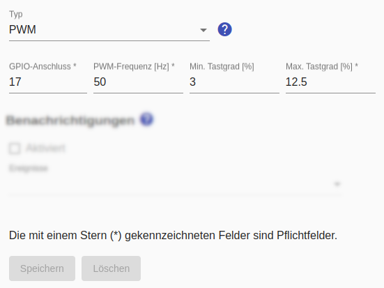
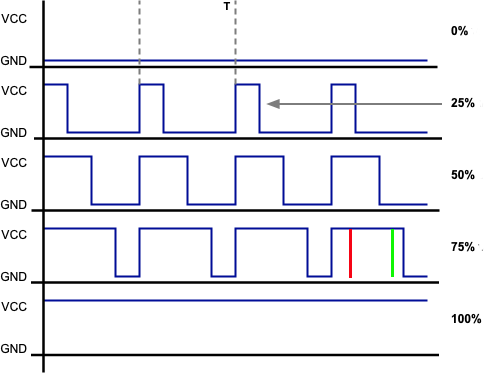

# PWM-Schalter
Ein PWM-Schalter ermöglicht die Steuerung von Verbrauchern mit **variabler Leistungsaufnahme** sofern sich diese über [PWM (Pulsweitenmodulation)](https://de.wikipedia.org/wiki/Pulsdauermodulation) steuern lassen. Die **GPIO-Anschlüsse** des Raspberry Pi können nicht nur ein- und ausgeschaltet werden, sondern auch ein PWM-Signal senden.

In den [Einstellungen für das Gerät](Appliance_DE.md) muss ein Wert für die *Min. Leistungsaufnahme* eingegeben werden. Ausserdem muss ein [Zeitplan für Überschussenergie](Schedules_DE.md) konfiguriert sein.

Die nachfolgende Abbildung zeigt die PWM-Einstellungen für ein Modellbau-Servo:



Bei der Konfiguration des GPIO-Anschlusses sollten unbedingt die [Hinweise zum Raspberry Pi und zur Numerierung der GPIO-Anschlüsse](Raspberry_DE.md) beachtet werden!

Das nachfolgende Bild zeigt in blauer Farbe verschiedene Tastgrade (0% bis 100%), wobei der min. Tastgrad 0% und der max. Tastgrad 100% ist. In Abhängigkeit von Gerät bzw. Steuerung kann es erforderlich sein, einen min. Tastgrad nicht zu unterschreiten (rote Farbe: ca. 25%) und/oder einen max. Tastgrad nicht zu überschreiten (grüne Farbe: ca. 60%).



Der für die Steuerung durch den *Smart Appliance Enabler* nutzbare Bereich beginnt beim min. Tastgrad und endet beim max. Tastgrad.

Im einfachsten Fall ist der min. Tastgrad 0% und der max. Tastgrad 100%. Hier kann der *Smart Appliance Enabler* den Leistungsaufnahmebereich zwischen min. Leistungsaufnahme (im einfachsten Fall 0W) und max. Leistungsaufnahme auf diese 100% mappen.

Komplizierter ist es, wenn ein min. Tastgrad (rote Farbe: ca. 25%) und ein max. Tastgrad (grüne Farbe: ca. 60%) zu berücksichtigen sind. Damit stehen nur 60%-25%=35% Tastgrad zur Verfügung, um die Spanne zwischen min. Leistungsaufnahme (z.B. 1000W) und max. Leistungsaufnahme (z.B. 4000W) abzubilden. Dabei entspricht eine Leistungsaufnahme von 1000W einem Tastgrad von 25% und eine Leistungsaufnahme von 4000W einem Tastgrad von 60%. 

Für die Konfiguration des PWM-Signals muss mindestens die `PWM-Frequenz` angegeben werden.

## Log
Wird ein Gerät (hier `F-00000001-000000000001-00`) mit konfiguriertem PWM-Schalter gesteuert, kann man die Steuerbefehle im [Log](Logging_DE.md) mit folgendem Befehl anzeigen:

```bash
$ grep "c.PwmSwitch" /tmp/rolling-2022-03-27.log | grep F-00000001-000000000001-00
2022-03-27 08:00:49,798 INFO [MQTT Call: F-00000001-000000000001-00-PwmSwitch] d.a.s.c.PwmSwitch [PwmSwitch.java:144] F-00000001-000000000001-00: Setting power to 2000
2022-03-27 08:00:49,799 INFO [MQTT Call: F-00000001-000000000001-00-PwmSwitch] d.a.s.c.PwmSwitch [PwmSwitch.java:158] F-00000001-000000000001-00: Setting GPIO 17 duty cycle to 310
```

*Webmin*: In [View Logfile](Logging_DE.md#user-content-webmin-logs) gibt man hinter `Only show lines with text` den Text `c.PwmSwitch` ein und drückt Refresh.