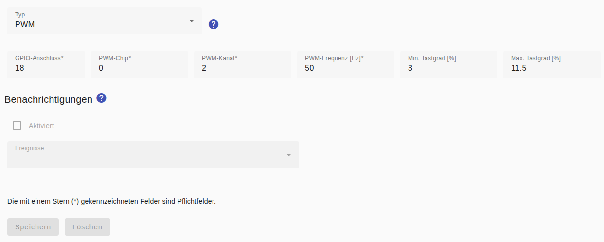

# PWM-Schalter
Ein PWM-Schalter ermöglicht die Steuerung von Verbrauchern mit **variabler Leistungsaufnahme** sofern sich diese über [PWM (Pulsweitenmodulation)](https://de.wikipedia.org/wiki/Pulsdauermodulation) steuern lassen. Dazu nutzt der *Smart Appliance Enabler* den [Linuxfs Provider von Pi4J](https://www.pi4j.com/documentation/io-types/pwm/), welcher nur Hardware-PWM untersützt (ab Raspberry Pi 4 verfügbar).

Auf dem Raspberry Pi muss [PWM zunächst aktiviert werden](https://www.pi4j.com/documentation/io-types/pwm/#pwm-gpios-1).  Auf meinem Raspberry Pi 5 mit Raspberry Pi OS Trixie habe ich dazu in der Datei `/boot/firmware/config.txt` am Dateiende hinter `[all]` die Zeile  hinzugefügt, um GPIO 18 als PWM-Ausgang zu konfigurieren:
```shell
dtoverlay=pwm,pin=18
```
Die Änderung wird erst nach einem Neustart des Raspberry Pi wirksam!

Für den GPIO 18 wird der Channel 2 verwendet, welcher im *Smart Appliance Enabler* in der Konfiguration des Schalters als "GPIO-Anschluss" angegeben werden muss, d.h. anders als man denken würde wird hier nicht der Wert 18 (die GPIO-Nummer) sondern der Wert 2 (der PWM-Channel) angegeben!

In den [Einstellungen für das Gerät](Appliance_DE.md) muss ein Wert für die *Min. Leistungsaufnahme* eingegeben werden. Ausserdem muss ein [Zeitplan für Überschussenergie](Schedules_DE.md) konfiguriert sein.

Außer dem GPIO-Anschluss muss mindesten noch die PWM-Frequenz angegeben werden, die bestimmt, wie oft pro Sekunde das PWM-Signal übertragen wird. Der Umkehrwert der PWM-Frequenz ist die maximal Zeitdauer eines PWM-Signals, d.h. bei einer PWM-Frequenz von 50Hz beträgt die maximale Zeitdauer eines PWM-Signals 1/50s = 20ms.



Der *Smart Appliance Enabler* berechnet aus der gewünschten Leistungsaufnahme und den im *Smart Appliance Enabler* konfigurierten Werten für *Min. Leistungsaufnahme*, *Max. Leistungsaufnahme*, *min. Tastgrad* und *max. Tastgrad* den Tastgrad des PWM-Signals, welcher dann über den angegebenen GPIO-Anschluss ausgegeben wird. Je höher die gewünschte Leistungsaufnahme, desto höher der Tastgrad. Wird ein Tastgrad von 0 berechnet, wird der GPIO-Ausgang auf LOW gesetzt.

## Keine Angabe von min. und max. Tastgrad
Die gewünschte Leistungsaufnahme wird vom *Smart Appliance Enabler* so übersetzt, dass ein Tastgrad von 0% der im *Smart Appliance Enabler* konfigurierten *Min. Leistungsaufnahme* entspricht und ein Tastgrad von 100% der im *Smart Appliance Enabler* konfigurierten *Max. Leistungsaufnahme*.

## Angabe von min. und/oder max. Tastgrad
Die gewünschte Leistungsaufnahme wird vom *Smart Appliance Enabler* so übersetzt, dass der min. Tastgrad der im *Smart Appliance Enabler* konfigurierten *Min. Leistungsaufnahme* entspricht und der max. Tastgrad der im *Smart Appliance Enabler* konfigurierten *Max. Leistungsaufnahme*.


## Beispiel: Modellbau-Servo
Modellbau-Servos werden über PWM-Signale gesteuert, wobei die Position des Servos-Arms durch den Tastgrad des PWM-Signals bestimmt wird. Üblicherweise beträgt die PWM-Frequenz 50Hz. Der linke Anschlag hat einen Tastgrad von ca. 3% (1ms Pulsdauer), die Mittelstellung einen Tastgrad von ca. 7,25% (1,5ms Pulsdauer) und der rechte Anschlag einen Tastgrad von ca. 11,5% (2ms Pulsdauer).

## Log
Wird ein Gerät (hier `F-00000001-000000000001-00`) mit konfiguriertem PWM-Schalter gesteuert, kann man die Steuerbefehle im [Log](Logging_DE.md) mit folgendem Befehl anzeigen:

```bash
$ grep "c.PwmSwitch" /tmp/rolling-2026-05-17.log | grep F-00000001-000000000001-00
2026-05-17 17:07:05,179 DEBUG [Thread-3] d.a.s.c.PwmSwitch [PwmSwitch.java:130] F-00000001-000000000001-00: Starting for GPIO 2
2026-05-17 17:07:05,255 INFO [Thread-3] d.a.s.c.PwmSwitch [PwmSwitch.java:214] F-00000001-000000000001-00: Setting GPIO 2 duty cycle to 0.0% (0 ms)
2026-05-17 17:07:05,256 DEBUG [Thread-3] d.a.s.c.PwmSwitch [PwmSwitch.java:135] F-00000001-000000000001-00: using GPIO 2 with pwmFrequency=50 minDutyCycle=3.0(0 ms) maxDutyCycle=11.5(2 ms)
[...]
2026-05-17 17:09:39,459 INFO [MQTT Call: F-00000001-000000000001-00-PwmSwitch-0] d.a.s.c.PwmSwitch [PwmSwitch.java:190] F-00000001-000000000003-00: Setting power to 6000W
2026-05-17 17:09:39,459 DEBUG [MQTT Call: F-00000001-000000000001-00-PwmSwitch-0] d.a.s.c.PwmSwitch [PwmSwitch.java:209] F-00000001-000000000003-00: Calculated duty cycle=7.25% from power ratio=0.5
2026-05-17 17:09:39,459 INFO [MQTT Call: F-00000001-000000000001-00-PwmSwitch-0] d.a.s.c.PwmSwitch [PwmSwitch.java:214] F-00000001-000000000003-00: Setting GPIO 2 duty cycle to 7.25% (1 ms)
```

*Webmin*: In [View Logfile](Logging_DE.md#user-content-webmin-logs) gibt man hinter `Only show lines with text` den Text `c.PwmSwitch` ein und drückt Refresh.