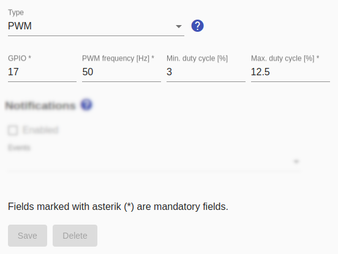

# PWM switch
A PWM switch enables consumers with **variable power consumption** to be controlled if they can be controlled via [PWM (pulse width modulation)](https://de.wikipedia.org/wiki/Pulsdurationmodulation). The **GPIO ports** of the Raspberry Pi can not only be switched on and off, but also send a PWM signal.

In the [Device Settings](Appliance_EN.md) a value for the *Min. Power consumption* can be entered. In addition, an [Excess Energy Schedule](Schedules_EN.md) must be configured.

The figure below shows the PWM settings for a model making servo:



When configuring the GPIO connection, it is essential to observe the [Notes on the Raspberry Pi and the numbering of the GPIO connections](Raspberry_EN.md)!

The following image shows different duty cycles (0% to 100%) in blue, with the minimum duty cycle being 0% and the maximum duty cycle being 100%. Depending on the device or controller, it may be necessary not to fall below a minimum duty cycle (red color: approx. 25%) and/or not to exceed a maximum duty cycle (green color: approx. 60%).


The range that can be used for control by the *Smart Appliance Enabler* starts at the minimum duty cycle and ends at the maximum duty cycle.

In the simplest case, the minimum duty cycle is 0% and the maximum duty cycle is 100%. Here the *Smart Appliance Enabler* can map the power consumption range between min. power consumption (in the simplest case 0W) and max. power consumption to this 100%.

It is more complicated if a minimum duty cycle (red color: approx. 25%) and a maximum duty cycle (green color: approx. 60%) have to be taken into account. This means that only 60%-25%=35% duty cycle is available to map the range between min. power consumption (e.g. 1000W) and max. power consumption (e.g. 4000W). A power consumption of 1000W corresponds to a duty cycle of 25% and a power consumption of 4000W to a duty cycle of 60%.

At least the `PWM frequency` must be specified for the configuration of the PWM signal.

## Log
If a device (here `F-00000001-000000000001-00`) is controlled with a configured PWM switch, the control commands can be displayed in [Log](Logging_EN.md) with the following command:

```console
sae@raspi2:~ $ grep "c.PwmSwitch" /tmp/rolling-2022-03-27.log | grep F-00000001-000000000001-00
2022-03-27 08:00:49,798 INFO [MQTT Call: F-00000001-000000000001-00-PwmSwitch] d.a.s.c.PwmSwitch [PwmSwitch.java:144] F-00000001-000000000001-00: Setting power to 2000
2022-03-27 08:00:49,799 INFO [MQTT Call: F-00000001-000000000001-00-PwmSwitch] d.a.s.c.PwmSwitch [PwmSwitch.java:158] F-00000001-000000000001-00: Setting GPIO 17 duty cycle to 310
```

*Webmin*: In [View Logfile](Logging_EN.md#user-content-webmin-logs) enter `c.PwmSwitch` after `Only show lines with text` and press refresh.