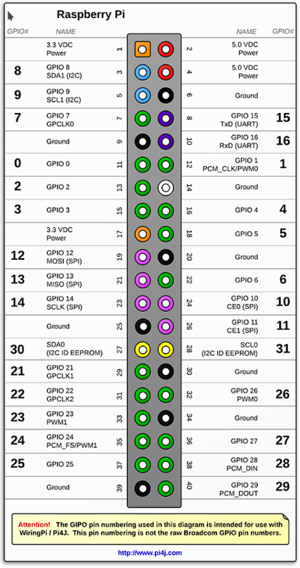

# Raspberry Pi
Der *Smart Appliance Enabler* benötigt einen **[Raspberry Pi](https://de.wikipedia.org/wiki/Raspberry_Pi) 2 Model B (oder neuer)** als Hardware. Dieser extrem preiswerte Kleinstcomputer (ca. 40 Euro) ist perfekt zum Steuern und Messen geeignet, da er bereits [digitale Ein-/Ausgabe-Schnittstellen](https://de.wikipedia.org/wiki/Raspberry_Pi#GPIO) enthält, die zum Schalten sowie zum Messen des Stromverbrauchs benötigt werden. Grundsätzlich kann man den *Smart Appliance Enabler* auch auf einem Raspberry Pi Zero betreiben, aber diese Platform ist offiziell nicht unterstützt und man sollte dann keinen Support bei Problemen erwarten.

An die GPIO-Pins des Raspberry können diverse Schalter und/oder Stromzähler angeschlossen werden, d.h. ein einziger Raspberry Pi kann eine Vielzahl von Geräten verwalten. Dabei darf jedoch die **Stromstärke** am 5V-Pin den Wert von 300 mA (Model B) bzw. 500mA (Model A) und am 3,3V-Pin den Wert von 50mA nicht überschreiten ([Quelle](http://elinux.org/RPi_Low-level_peripherals#General_Purpose_Input.2FOutput_.28GPIO.29))!

Der *Smart Appliance Enabler* verwendet intern [Pi4J](https://pi4j.com) um auf die GPIO-Pins zuzugreifen. Diese Bibliothek verwendet eine eigene Numerierung der GPIO-Pins, die ungleich der Pin-Nummer ist! Demzufolge muss im *Smart Appliance Enabler* diese Nummer als *GPIO-Anschluss* eingegeben werden.



## Ausschalten / Neu starten

Wie jeder Computer mit einem Speichermedium mit Schreibzugriff sollte der Raspberry Pi nicht einfach von der Stromquelle getrennt werden, um ihn auszuschalten oder neu zu starten. Dabei kann das Dateisystem oder die SD-Karte kaputt gehen.

Das Herunterfahren mit nachfolgendem Ausschalten erfolgt mit dem Befehl:
```console
sudo shutdown now
```

Das Herunterfahren mit nachfolgendem Neustart erfolgt mit dem Befehl:
```console
sudo shutdown -r now
```

*Webmin*: Wenn man im Seiten-Menü den Punkt `System` wählt und den Unterpunkt `Bootup and Shutdown` anklickt, finden sich ganz unten auf der Seite Schaltflächen für `Reboot System` und `Shutdown System`.
