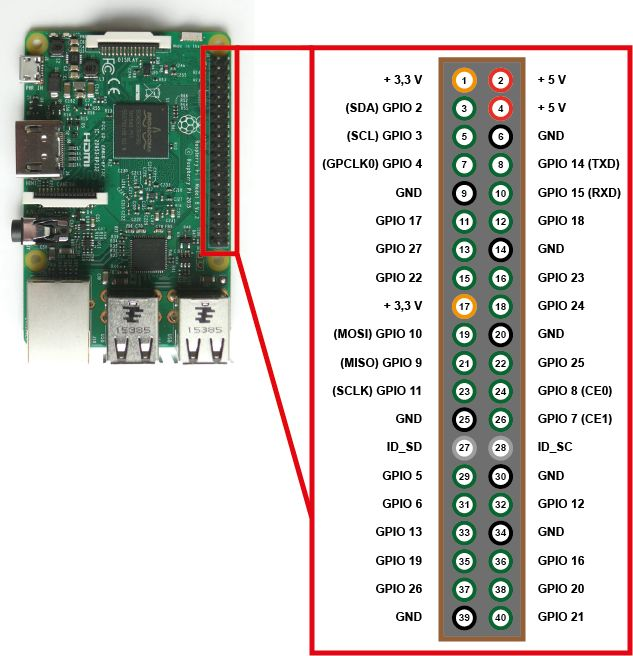

# Raspberry Pi
Der *Smart Appliance Enabler* benötigt einen **[Raspberry Pi](https://de.wikipedia.org/wiki/Raspberry_Pi) 2 Model B (oder neuer)** als Hardware. Dieser extrem preiswerte Kleinstcomputer (ca. 40 Euro) ist perfekt zum Steuern und Messen geeignet, da er bereits [digitale Ein-/Ausgabe-Schnittstellen](https://de.wikipedia.org/wiki/Raspberry_Pi#GPIO) enthält, die zum Schalten sowie zum Messen des Stromverbrauchs benötigt werden. Grundsätzlich kann man den *Smart Appliance Enabler* auch auf einem Raspberry Pi Zero betreiben, aber diese Platform ist offiziell nicht unterstützt und man sollte dann keinen Support bei Problemen erwarten.

An die GPIO-Pins des Raspberry können diverse Schalter und/oder Stromzähler angeschlossen werden, d.h. ein einziger Raspberry Pi kann eine Vielzahl von Geräten verwalten. Dabei darf jedoch die **Stromstärke** am 5V-Pin den Wert von 300 mA (Model B) bzw. 500mA (Model A) und am 3,3V-Pin den Wert von 50mA nicht überschreiten ([Quelle](http://elinux.org/RPi_Low-level_peripherals#General_Purpose_Input.2FOutput_.28GPIO.29))!

Um auf die GPIO-Pins zuzugreifen verwendet der *Smart Appliance Enabler* intern die Java-Bibliothek [Pi4J](https://www.pi4j.com).

Für die [Numerierung der Anschlusse wird dabei nicht die Pin-Nummer auf dem Raspberry Pi verwendet, sondern die GPIO-Nummer des Broadcom-Prozessors](https://raspberrypi.stackexchange.com/questions/12966/what-is-the-difference-between-board-and-bcm-for-gpio-pin-numbering).

Demzufolge muss im *Smart Appliance Enabler* diese Nummer als *GPIO-Anschluss* eingegeben werden.



Die aktuell Konfiguration der GPIO-Pins kann man sich mit dem Befehl `pinctrl` anschauen:

```shell
$ pinctrl
 0: ip    pu | hi // ID_SDA/GPIO0 = input
 1: ip    pu | hi // ID_SCL/GPIO1 = input
 2: ip    pu | hi // GPIO2 = input
 3: ip    pu | hi // GPIO3 = input
 4: ip    pu | hi // GPIO4 = input
 5: ip    pu | hi // GPIO5 = input
 6: ip    pu | hi // GPIO6 = input
 7: ip    pu | hi // GPIO7 = input
 8: ip    pu | hi // GPIO8 = input
 9: ip    pd | lo // GPIO9 = input
10: ip    pd | lo // GPIO10 = input
11: ip    pd | lo // GPIO11 = input
12: ip    pd | lo // GPIO12 = input
13: ip    pd | lo // GPIO13 = input
14: ip    pn | lo // GPIO14 = input
15: ip    pu | hi // GPIO15 = input
16: ip    pd | lo // GPIO16 = input
17: ip    pd | lo // GPIO17 = input
18: ip    pd | lo // GPIO18 = input
19: ip    pd | lo // GPIO19 = input
20: ip    pd | lo // GPIO20 = input
21: op -- pn | hi // GPIO21 = output
22: ip    pu | hi // GPIO22 = input
[...]
```
Für jeden GPIO-Pin sieht man, ob er als Input (`ip`, z.B. für Schalter) oder Output (`op`, z.B. für S0-Zähler) konfiguriert ist. Außerdem die Konfiguration des Widerstands (`pd` für Pull-Down und `pu` für Pull-Up), sowie den aktuell Status (`hi` für "high" bzw. 3,3V und `lo` für "low" bzw. 0V).

## Ausschalten / Neu starten

Wie jeder Computer mit einem Speichermedium mit Schreibzugriff sollte der Raspberry Pi nicht einfach von der Stromquelle getrennt werden, um ihn auszuschalten oder neu zu starten. Dabei kann das Dateisystem oder die SD-Karte kaputt gehen.

Das Herunterfahren mit nachfolgendem Ausschalten erfolgt mit dem Befehl:

```bash
$ sudo shutdown now
```

Das Herunterfahren mit nachfolgendem Neustart erfolgt mit dem Befehl:

```bash
$ sudo shutdown -r now
```

*Webmin*: Wenn man im Seiten-Menü den Punkt `System` wählt und den Unterpunkt `Bootup and Shutdown` anklickt, finden sich ganz unten auf der Seite die Schaltflächen für `Reboot System` und `Shutdown System`.
