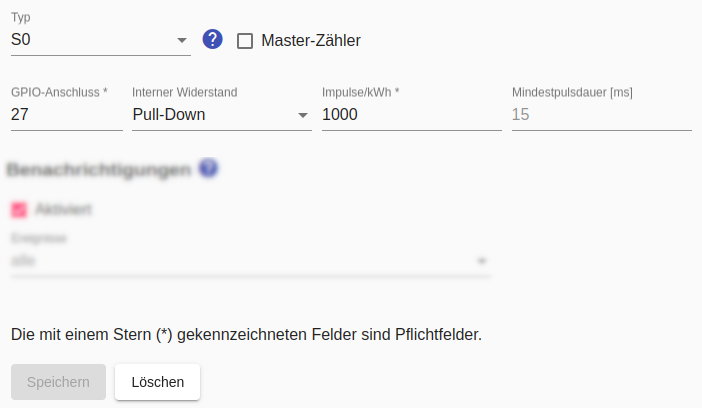
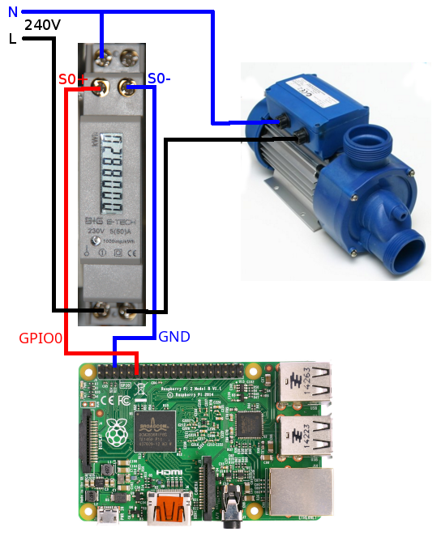

# Digitale Stromzähler mit S0-Ausgang
Der Raspberry Pi verfügt über **GPIO-Anschlüsse**, an denen Impulse eines digitalen Stromzählers mit S0-Ausgang ausgewertet werden können. Dabei sollten unbedingt die Hinweise im Kapitel zum [Raspberry Pi](Raspberry_DE.md) beachtet werden, insbesondere auch zur **Numerierung der GPIO-Anschlüsse**.

Zur Konfiguration eines S0-Stromzählers gehört die Nummer des GPIO-Anschlusses, die Konfiguration des internen Widerstands (Pull-Up / Pull-Down - siehe unten) sowie die Anzahl der Impulse pro kWh.

Für die Genauigkeit des Zählers ist die Anzahl der Impulse pro kWh wichtig. Die meisten aktuellen Zähler bieten hier 1000 Impulse je kWh. Persönlich bin ich sehr zufrieden mit den Zählern von [B+G E-Tech](http://www.bg-etech.de/), die zudem recht günstig sind.



## Log
Wird ein S0-Zähler für das Gerät `F-00000001-000000000012-00` verwendet, kann man die ermittelte Leistungsaufnahme im [Log](Logging_DE.md) mit folgendem Befehl anzeigen:

```bash
$ grep S0ElectricityMeter /tmp/rolling-2021-01-01.log | grep F-00000001-000000000012-00
2021-01-01 13:00:00,064 DEBUG [pi4j-gpio-event-executor-46] d.a.s.m.S0ElectricityMeter [S0ElectricityMeter.java:189] F-00000001-000000000012-00: S0 impulse detected on GPIO 2
2021-01-01 13:00:00,066 DEBUG [pi4j-gpio-event-executor-46] d.a.s.m.S0ElectricityMeter [S0ElectricityMeter.java:193] F-00000001-000000000012-00: power: 2077W
2021-01-01 13:00:01,823 DEBUG [pi4j-gpio-event-executor-46] d.a.s.m.S0ElectricityMeter [S0ElectricityMeter.java:189] F-00000001-000000000012-00: S0 impulse detected on GPIO 2
2021-01-01 13:00:01,833 DEBUG [pi4j-gpio-event-executor-46] d.a.s.m.S0ElectricityMeter [S0ElectricityMeter.java:193] F-00000001-000000000012-00: power: 2076W
2021-01-01 13:05:47,602 DEBUG [pi4j-gpio-event-executor-47] d.a.s.m.S0ElectricityMeter [S0ElectricityMeter.java:189] F-00000001-000000000012-00: S0 impulse detected on GPIO 2
2021-01-01 13:05:47,604 DEBUG [pi4j-gpio-event-executor-47] d.a.s.m.S0ElectricityMeter [S0ElectricityMeter.java:193] F-00000001-000000000012-00: power: 10W
```

*Webmin*: In [View Logfile](Logging_DE.md#user-content-webmin-logs) gibt man hinter `Only show lines with text` den Text `S0ElectricityMeter` ein und drückt Refresh.

## Schaltung
Der für den Zähler verwendete GPIO-Eingang muß auf einen definierten Grundzustand gesetzt werden, um den Einfluss von Störungen zu minimieren. Dabei unterscheidet man zwischen **Pull-Up** und **Pull-Down** (für Details siehe https://www.elektronik-kompendium.de/sites/raspberry-pi/2006051.htm).

Grundsätzlich sollte das Kabel zwischen Zähler und Raspberry Pi möglichst kurz sein (max. 20-30 cm). Sollte ein längeres Kabel notwendig sein, ist nach meinen Erfahrungen die Schaltung als **Pull-Up** weniger anfällig für Störungen.

In den nachfolgenden Schaltbeispielen ist der notwendige Widerstand für Pull-Down/Pull-Down nicht eingezeichnet, weil dieser auf dem Raspberry Pi selbst vorhandenen ist und vom *Smart Appliance Enabler* per Software-Konfiguration aktiviert wird.

### Schaltbeispiel Pull-Up
Die Schaltung zum Messen des Stromverbrauchs eines 240V-Gerätes (z.B. Pumpe) könnte wie folgt aussehen:



### Schaltbeispiel Pull-Down
Die Schaltung zum Messen des Stromverbrauchs eines 240V-Gerätes (z.B. Pumpe) könnte wie folgt aussehen:


