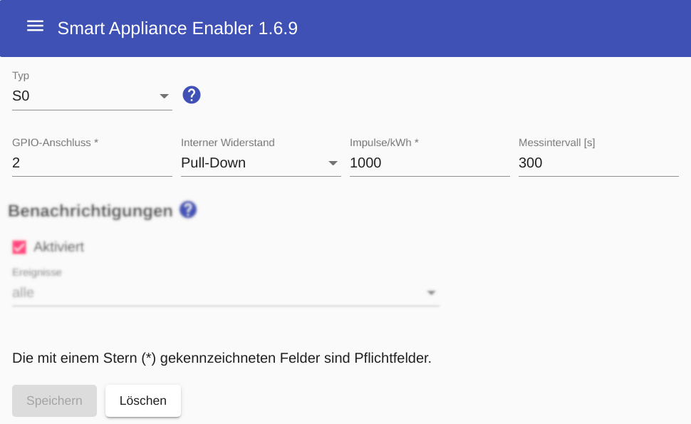

# Electricity meter feat. S0 signal

The Raspberry Pi has **GPIO connections**, on which pulses from a digital electricity meter with S0 output can be evaluated. The notes in the chapter on the [Raspberry Pi](Raspberry_EN.md) should be observed, especially regarding the **numbering of the GPIO connections**.

The configuration of an S0 electricity meter includes the number of the GPIO connection, the configuration of the internal resistance (pull-up / pull-down - see below) and the number of pulses per kWh.

The number of pulses per kWh is important for the accuracy of the meter. Most current meters offer 1000 pulses per kWh. Personally, I am very satisfied with the meters from [B+G E-Tech](http://www.bg-etech.de/), which are also quite cheap.



## Log
If an S0 meter is used for the device `F-00000001-000000000012-00`, the determined power consumption can be displayed in [Log](Logging_EN.md) with the following command:

```console
sae@raspi:~ $ grep S0ElectricityMeter /tmp/rolling-2021-01-01.log | grep F-00000001-000000000012-00
2021-01-01 13:00:00,064 DEBUG [pi4j-gpio-event-executor-46] d.a.s.m.S0ElectricityMeter [S0ElectricityMeter.java:189] F-00000001-000000000012-00: S0 impulse detected on GPIO 2
2021-01-01 13:00:00,066 DEBUG [pi4j-gpio-event-executor-46] d.a.s.m.S0ElectricityMeter [S0ElectricityMeter.java:193] F-00000001-000000000012-00: power: 2077W
2021-01-01 13:00:01,823 DEBUG [pi4j-gpio-event-executor-46] d.a.s.m.S0ElectricityMeter [S0ElectricityMeter.java:189] F-00000001-000000000012-00: S0 impulse detected on GPIO 2
2021-01-01 13:00:01,833 DEBUG [pi4j-gpio-event-executor-46] d.a.s.m.S0ElectricityMeter [S0ElectricityMeter.java:193] F-00000001-000000000012-00: power: 2076W
2021-01-01 13:05:47,602 DEBUG [pi4j-gpio-event-executor-47] d.a.s.m.S0ElectricityMeter [S0ElectricityMeter.java:189] F-00000001-000000000012-00: S0 impulse detected on GPIO 2
2021-01-01 13:05:47,604 DEBUG [pi4j-gpio-event-executor-47] d.a.s.m.S0ElectricityMeter [S0ElectricityMeter.java:193] F-00000001-000000000012-00: power: 10W
```

*Webmin*: In [View Logfile](Logging_EN.md#user-content-webmin-logs) enter `S0ElectricityMeter` after `Only show lines with text` and press Refresh.

## Wiring
The GPIO input used for the counter must be set to a defined basic state in order to minimize the influence of disturbances. A distinction is made between **Pull-Up** and **Pull-Down** (for details see https://www.elektronik-kompendium.de/sites/raspberry-pi/2006051.htm).

Basically, the cable between the meter and the Raspberry Pi should be as short as possible (max. 20-30 cm). If a longer cable is necessary, in my experience **pull-up** circuitry is less susceptible to interference.

The necessary resistance for pull-down/pull-down is not shown in the following circuit examples, because this is available on the Raspberry Pi itself and is activated by the *Smart Appliance Enabler* via software configuration.

### Wiring example Pull-Up
The circuit for measuring the power consumption of a 240V device (e.g. pump) could look like this:


### Wiring example Pull-Down
The circuit for measuring the power consumption of a 240V device (e.g. pump) could look like this:


