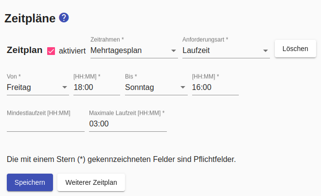
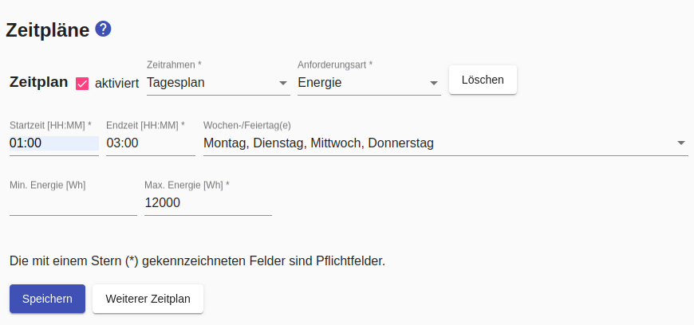

# Zeitpläne
Der *Sunny Home Manager* wird nur dann Geräte einplanen und einschalten, wenn eine Anforderung vorliegt. Neben Ad-Hoc-Anforderungen über die [Ampel](Status_DE.md) sind Zeitpläne das zentrale Element für (potentiell) regelmäßige Anforderungen (z.B. für Geschirrspüler, Waschmaschine, ...)

Falls ein Schalter-Typ konfiguriert wurde, der die Steuerung des Gerätes erlaubt, können Zeitpläne konfiguriert werden.

Ein Zeitplan hat einen Zeitrahmen, auf den er sich bezieht:
- `Tagesplan`: bezieht sich auf einen/alle Wochentage
- `Mehrtagesplan`: bezieht sich auf eine Dauer länger als 24 Stunden aber höchstens eine Woche

Für einen Tagesplan kann angegeben werden, dass dieser an Feiertagen gelten soll.
Dieser hat Vorrang vor anderen Tagesplänen, die entsprechend des Wochentages gelten würden. Voraussetzung dafür ist, dass das [Feiertagshandling in der Konfiguration aktiviert](Settings_DE.md#user-content-holidays) wurde.

Neben dem Zeitrahmen hat ein Zeitplan auch eine `Anforderungsart`, die (außer für [Appliances mit variabler Leistungsaufnahme](#variableLeistungsaufnahme)) immer `Laufzeit` ist. Dabei wird über die `Startzeit` und die `Endzeit` ein Zeitfenster definiert, innerhalb dessen der *Sunny Home Manager* die `maximale Laufzeit` unabhängig vom Vorhandensein von PV-Strom sicherstellen muss. Wird zusätzlich die (optionale) `minimale Laufzeit` angegeben, wird der *Sunny Home Manager* nur diese Laufzeit sicherstellen, aber bei Vorhandensein von *Überschussenenergie* die Laufzeit bis zur `maximalen Laufzeit` erweitern. Das Setzen einer `minimalen Laufzeit` von 0 führt dazu, dass das Gerät ausschliesslich mit Überschussenergie betrieben wird. Wenn diese nicht vorhanden ist, wird das Gerät nicht eingeschaltet.

Das Zeitfenster sollte deutliche größer sein, als die Laufzeit, um dem *Sunny Home Manager* eine optimale Planung zu ermöglichen. Um die Einplanung überhaupt sicherzustellen muss das Zeitfenster 30 Minuten grösser sein, als die Laufzeit. Beispielsweise genügt ein Zeitplan mit `Startzeit 8:00 / Endzeit 20 Uhr/ Laufzeit 12 Stunden` dieser Minimalanforderung nicht, während der Zeitplan `Startzeit 7:00 / Endzeit 20 Uhr/ Laufzeit 12 Stunden` sie erfüllt.

Ein Zeitplan wird nur dann berücksichtigt, wenn er `aktiviert` ist. Damit kann man saisonal genutzte Geräte (z.B. Filterpumpe des Swimming Pools) deaktivieren, anstatt sie zu Löschen und später neu anlegen. Wenn ein Zeitplan mit `externe Aktivierung` gekennzeichnet ist, wird er ebenfalls ignoriert, bis er von Extern (z.B. durch eine MQTT-Nachricht) aktiviert wird. 

Es ist möglich für ein Gerät auch mehrere Zeitpläne anzulegen. Hierbei muss darauf geachtet werden, dass die Zeitpläne **nicht überlappen**, zum Beispiel muss "Zeitplan 1" um 13:59 Uhr enden, wenn "Zeitplan 2" um 14:00 Uhr beginnen soll.

Beispiel für einen Tagesplan:

Beispiel für einen Mehrtagesplan:

Der *Smart Appliance Enabler* meldet dem Sunny Home Manager den Geräte-Laufzeitbedarf für die nächsten 48 Stunden, damit er auf dieser Basis optimal planen kann.

##  Besonderheiten für Verbraucher mit variabler Leistungsaufnahme
Bei Verbrauchern mit variabler Leistungsaufnahme wird vom *Sunny Home Manager* auch die momentan zulässige Leistungsaufnahme vorgegeben.

Der *Smart Appliance Enabler* unterstützt die Nutzung folgender Schaltertypen bzw. Geräte mit variabler Leistungsaufnahme:
* [Stufenschalter](LevelSwitch_DE.md)
* [PWM-Schalter](PwmSwitch_DE.md)
* [Wallboxen](EVCharger_DE.md)

Bei Verbrauchern mit variabler Leistungsaufnahme können als **Anforderungsart** zwei andere Optionen verfügbar sein:

### Soll-SOC
Mit der Anforderungsart `Laden bis SOC` wird genau die Energie angefordert, die notwendig ist, um einen bestimmten SOC zu erreichen. Zur Berechnung dieser Energiemenge wird die Batteriekapazität und der SOC des Fahrzeugs bei Ladebeginn herangezogen. Für letzteres ist es notwendig, dass der [SOC des Fahrzeugs via Script](soc/SOC_DE.md) abgefragt werden kann.

### Energie
Mit der Anforderungsart `Energie` wird anzufordernde Energie direkt vorgegeben. Dabei wird über die Startzeit und die Endzeit ein Zeitfenster definiert, innerhalb dessen der Sunny Home Manager die `maximale Energie` unabhängig vom Vorhandensein von PV-Strom sicherstellen muss. Wird zusätzlich die (optionale) `minimale Energie` angegeben, wird der Sunny Home Manager nur diese Energie garantiert bereitstellen, aber bei Vorhandensein von Überschussenenergie die bereitgestellte Energie bis zur maximalen Energie erweitern. Das Setzen einer minimalen Energie von 0 führt dazu, dass das Gerät ausschliesslich mit Überschussenergie betrieben wird. Wenn diese nicht vorhanden ist, wird das Gerät nicht eingeschaltet.

Siehe auch: [Allgemeine Hinweise zur Konfiguration](Configuration_DE.md)
