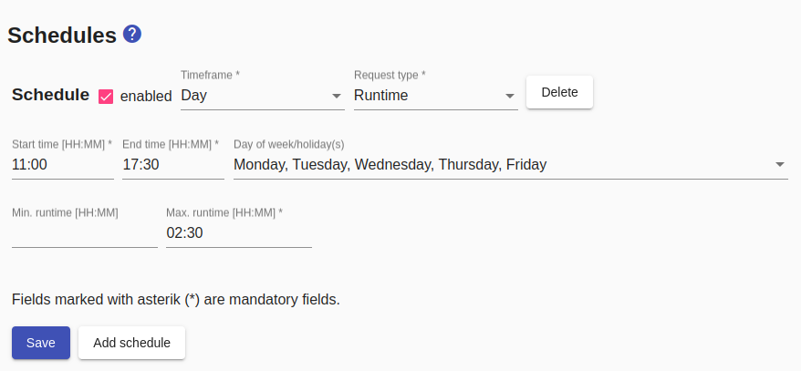
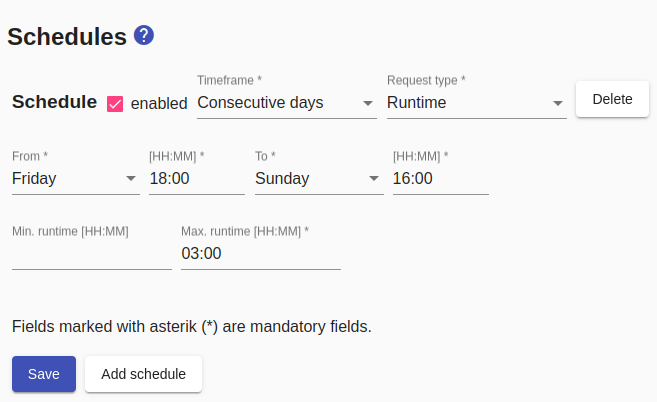
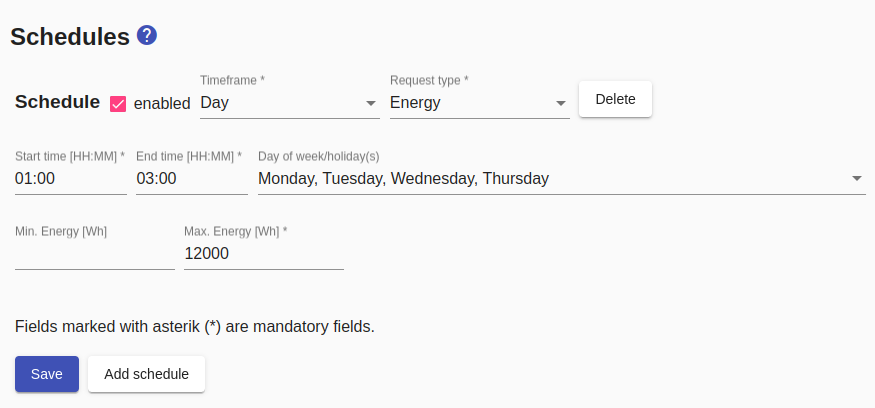

# Schedules
The *Sunny Home Manager* will only plan and switch on devices if there is a demand. In addition to ad hoc demand via the [traffic light](Status_EN.md), schedules are the central element for (potentially) regular demands (e.g. for dishwashers, washing machines, ...)

If a control type has been configured that allows the device to be controlled, schedules can be configured.

A schedule has a time frame to which it refers:
- `Day`: refers to one/all days of the week
- `Consecutive days`: refers to a duration longer than 24 hours but no more than one week

A daily schedule can be specified to apply on public holidays.
This takes precedence over other daily schedules that would apply according to the day of the week. The prerequisite for this is that [holiday handling activated in the configuration](Settings_EN.md#user-content-holidays) has been activated.

In addition to the time frame, a schedule also has a `request type`, which (except for [appliances with variable power consumption](variablePowerConsumption)) is always `runtime`. A time window is defined via the `start time` and the `end time` within which the *Sunny Home Manager* must ensure the `maximum runtime` regardless of the presence of PV power. If the (optional) `minimum runtime` is also specified, the *Sunny Home Manager* will only ensure this runtime, but will extend the runtime up to the `maximum runtime` if there is *excess energy*. Setting the 'minimum runtime' of 0 means that the device is only operated with excess energy. If this is not present, the device will not turn on.

The time window should be significantly larger than the runtime to enable the *Sunny Home Manager* to plan optimally. In order to ensure planning at all, the time window must be 30 minutes longer than the running time. For example, a schedule with `start time 8:00 am / end time 8:00 pm / run time 12 hours` does not meet this minimum requirement, while the schedule `start time 7:00 am / end time 8:00 pm / run time 12 hours` does.

A schedule is only taken into account if it is 'enabled'. This allows you to deactivate devices that are used seasonally (e.g. swimming pool filter pump) instead of deleting them and creating them again later. If a schedule is marked with `external activation`, it will also be ignored until it is activated externally (e.g. by an MQTT message).

It is also possible to create several schedules for one appliance. Care must be taken that the schedules **do not overlap**, for example "schedule 1" must end at 13:59 if "schedule 2" is to start at 14:00.

_Example of a daily schedule_

_Example of a multi-day plan_

The *Smart Appliance Enabler* reports the device runtime requirement for the next 48 hours to the Sunny Home Manager so that it can plan optimally on this basis.

##  Special features  for consumer with variable power consumption

In the case of loads with variable power consumption, the *Sunny Home Manager* also specifies the currently permissible power consumption.

The *Smart Appliance Enabler* supports the use of the following switch types or devices with variable power consumption:
* [Level switch](LevelSwitch_EN.md)
* [PWM switch](PwmSwitch_EN.md)
* [Wallboxes](EVCharger_EN.md)

For consumers with variable power consumption, two other are available for **request type**:

### Target SOC
With the request type `Charge until SOC`, exactly the energy required to reach a specific SOC is requested. The battery capacity and the SOC of the vehicle at the start of charging are used to calculate this amount of energy. For the latter it is necessary that the [SOC of the vehicle via script](soc/SOC_EN.md) can be queried.

### Energy
With the request type 'Energy', the energy to be requested can be specified directly. A time window is defined via the start time and the end time, within which the Sunny Home Manager must ensure the "maximum energy" regardless of the presence of PV power. If the (optional) "minimum energy" is also specified, the Sunny Home Manager is only guaranteed to provide this energy, but if there is excess energy, it will expand the provided energy up to the maximum energy. Setting a minimum energy of 0 results in the device being operated exclusively with excess energy. If this is not present, the device will not turn on.

See also: [General notes on configuration](Configuration_EN.md)
