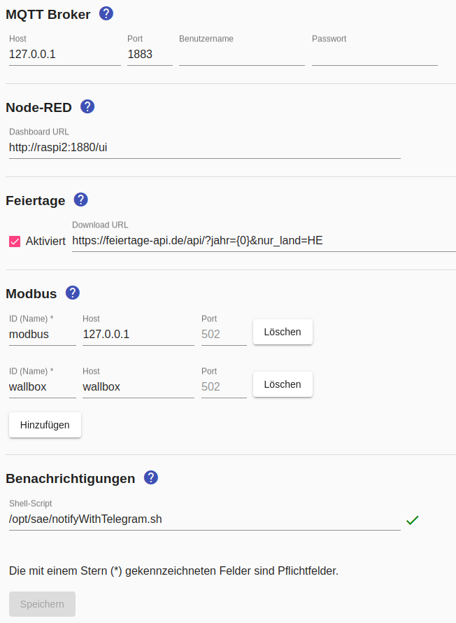

# Einstellungen
Über den Menüpunkt `Einstellungen` gelangt man zur Verwaltung der zentralen, geräteunabhängigen Einstellungen.



## <a name="holidays"></a> Feiertage

Die Feiertage werden aus der Datei `Holidays-JJJJ.txt` gelesen, wobei JJJJ durch die Jahreszahl ersetzt wird, d.h. die Feiertage für 2017 finden sich in der Datei `Holidays-2017.txt`. 
Die Datei muss sich sich in dem Verzeichnis befinden, auf das die Variable `SAE_HOME` verweist (normalerweise `/opt/sae`). 
Der Inhalt der Datei ist wie folgt aufgebaut:

```
2017-01-01 Neujahrstag
2017-04-14 Karfreitag
2017-04-17 Ostermontag
2017-05-01 Tag der Arbeit
...
```

Sofern der Raspberry Zugang zum Internet hat, erfolgt einmal jährlich ein Download dieser Datei. Wenn die Datei vorhanden ist (entweder von einem vorangegangenen Download oder weil sie manuell dort erstellt wurde), erfolgt keine Abfrage im Internet. Standardmäßig werden nur die bundesweiten Feiertage berücksichtigt. Durch Angabe des folgenden Konfigurationsparameters kann sowohl die URL des Dienstes geändert als auch bundeslandspezifische Feiertage berücksichtigt werden:

```
<Appliances>
  <Configuration param="Holidays.Url" value="http://feiertage.jarmedia.de/api/?jahr={0}&nur_land=HE"/>
  <Appliance>
  ...
  </Appliance>
</Appliances>
```

HE steht dabei für Hessen, die Abkürzung für andere Bundesländer und die vollständige API-Dokumentation findet sich auf http://feiertage.jarmedia.de. Anstelle der Jahreszahl muss "{0}" (ohne Anführungszeichen) verwendet werden, was zum Ausführungszeitpunkt durch die aktuelle Jahreszahl ersetzt wird.

## <a name="modbus"></a> Modbus

Bevor Modbus für Zähler oder Schalter verwendet werden kann, muss mindestens ein Modbus/TCP konfiguriert werden.

Für jeden Modbus/TCP muss eine eindeutige ID festgelegt werden, die bei der Konfiguration von Modbus-Zählern und Schaltern angegeben wird (z.B. "wallbox").
Die Angabe von Hostname bzw. IP-Adresse und Port ist optional möglich.

## <a name="notifications"></a> Benachrichtigungen

Zur Verwendung von Benachrichtigungen muss ein Shell-Script angegeben werden, das beim Auftreten eines konfigurierten Ereignisses aufgerufen wird.

Die Installation von bereitgestellten Shell-Scripts für den *Smart Appliance Enabler* ist [hier](InstallationManual_DE.md#notifications) beschrieben.

