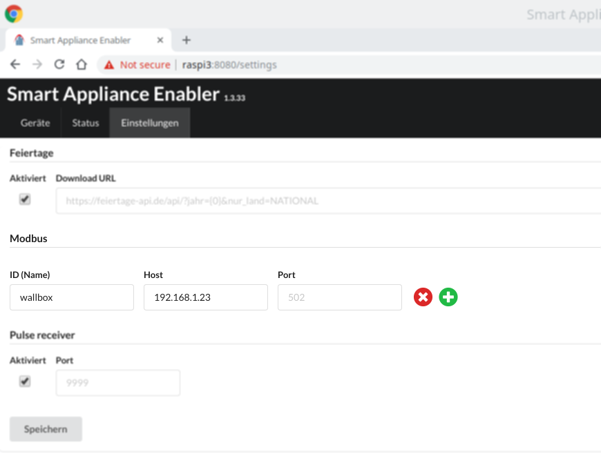
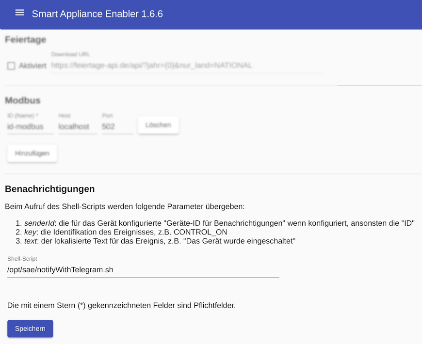

# Einstellungen
Das Menü ```Einstellungen``` findet sich oben auf der Seite.

## Feiertage

Die Feiertage werden aus der Datei ```Holidays-JJJJ.txt``` gelesen, wobei JJJJ durch die Jahreszahl ersetzt wird, d.h. die Feiertag für 2017 finden sich in der Datei ```Holidays-2017.txt```. Die Datei muss sich im gleichen Verzeichnis wie die Datei ```Appliances.xml``` befinden und ist wie folgt aufgebaut:
```
2017-01-01 Neujahrstag
2017-04-14 Karfreitag
2017-04-17 Ostermontag
2017-05-01 Tag der Arbeit
...
```
Sofern der Raspberry Zugang zum Internet hat, werden die Feiertage einmal jährlich im Internet abgefragt und in dieser Datei gespeichert. Wenn die Datei vorhanden ist (entweder von einem vorangegangenen Download oder weil sie manuell dort erstellt wurde), erfolgt keine Abfrage im Internet. Standardmäßig werden nur die bundesweiten Feiertage berücksichtigt. Durch Angabe des folgenden Konfigurationsparameters kann sowohl die URL des Dienstes geändert als auch bundeslandspezifische Feiertage berücksichtigt werden:
```
<Appliances>
  <Configuration param="Holidays.Url" value="http://feiertage.jarmedia.de/api/?jahr={0}&#038;nur_land=HE"/>
  <Appliance>
  ...
  </Appliance>
</Appliances>
```
HE steht dabei für Hessen, die Abkürzung für andere Bundesländer und die vollständige API-Dokumentation findet sich auf http://feiertage.jarmedia.de. Anstelle der Jahreszahl muss "{0}" (ohne Anführungszeichen) verwendet werden, was zum Ausführungszeitpunkt durch die aktuelle Jahreszahl erstzt wird. Außerdem muss statt des "&"-Zeichens der Ausruck ```"&#038;"```  (ohne Anführungszeichen) verwendet werden.


## Modbus
Bevor Modbus für Zähler oder Schalter verwendet werden kann, müssen ein oder mehrer Modbus/TCP konfiguriert werden.

Für jeden Modbus/TCP muss eine eindeutige ID festgelegt werden, die bei der Konfiguration von Modbus-Zählern und Schaltern angegeben werden müss (z.B. "wallbox").
Die Angabe von Hostname bzw. IP-Adresse und Port ist optional möglich.



## Benachrichtigungen
Zur Verwendung von Benachrichtigungen muss ein Shell-Script angegeben werden, das beim Auftreten eines konfigurierten Ereignisses aufgerufen wird.



Die Installation von bereitgestellten Shell-Scripts ist [hier](Installation_DE.md#Benachrichtigungen) beschrieben.

