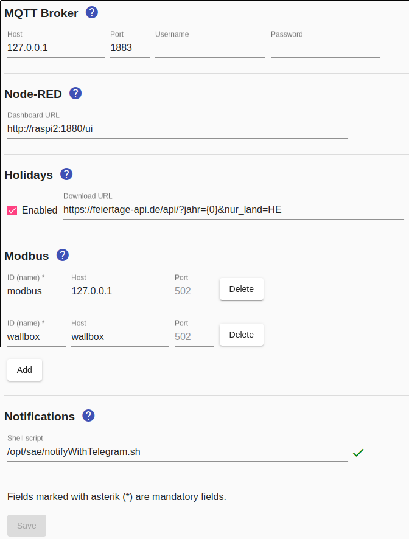

# Settings
The `Settings` menu item takes you to the administration of the central, device-independent settings.



## <a name="holidays"></a> Feiertage

The holidays are read from the `Holidays-YYYY.txt` file, where YYYY is replaced by the year, i.e. the holidays for 2017 can be found in the `Holidays-2017.txt` file.
The file must be in the directory pointed to by the `SAE_HOME` variable (usually `/opt/sae`).
The content of the file is structured as follows:
```
2017-01-01 New Year's Day
2017-04-14 Good Friday
2017-04-17 Easter Monday
2017-05-01 Labor Day
...
```
If the Raspberry has access to the Internet, this file is downloaded once a year. If the file exists (either from a previous download or because it was manually created there), no query will be made on the Internet. By default, only national holidays are taken into account. The URL of the service can be changed and state-specific holidays can be taken into account by specifying the following configuration parameter:
```
<Appliances>
  <Configuration param="Holidays.Url" value="http://feiertage.jarmedia.de/api/?jahr={0}&nur_land=HE"/>
  <Appliance>
  ...
  </Appliance>
</Appliances>
```
HE stands for Hessia, the abbreviation for other federal states and the complete API documentation can be found at http://ferien.jarmedia.de. "{0}" (without quotation marks) must be used instead of the year, which is replaced by the current year at run time.

## <a name="modbus"></a> Modbus

Before Modbus can be used for meters or switches, one or more Modbus/TCP must be configured.

A unique ID must be defined for each Modbus/TCP, which must be specified when configuring Modbus meters and switches (e.g. "wallbox").
Specifying the host name or IP address and port is optional.

## <a name="notifications"></a> Notifications

To use notifications, a shell script must be specified that is called when a configured event occurs.

The installation of provided shell scripts for the *Smart Appliance Enabler* is described [here](InstallationManual_EN.md#user-content-notifications).
