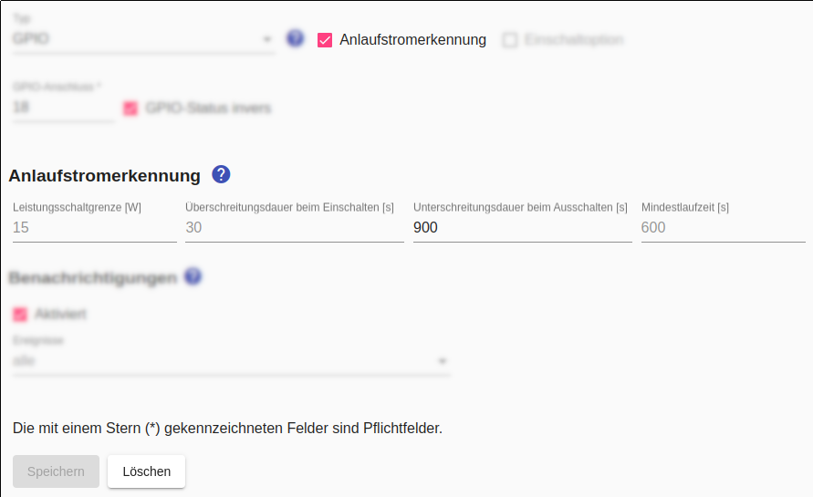

# Anlaufstromerkennung

Viele Geräte können nicht einfach eingeschaltet werden um direkt danach mit ihrer Arbeit zu beginnen, sondern müssen nach dem Einschalten zunächst programmiert werden. Dazu ist es erforderlich, dass das Gerät auch während dieser Zeit mit Strom versorgt wird. Bei Verwendung der Anlaufstromerkennung des *Smart Appliance Enabler* wird deshalb die Stromversorgung des Gerätes nur in der Zeit zwischen der Erkennung des Anlaufstromes und dem Empfang der Einschaltempfehlung des *Sunny Home Managers* unterbrochen.

Voraussetzung für die Nutzung der Anlaufstromerkennung ist deshalb das Bestehen des folgenden Tests:

_Einfach das Gerät an eine normale, stromführende Steckdose anschließen. Gerät einschalten und Programm starten. Nach 1-2 Minuten den Stecker ziehen. Nach einer weiteren Minute den Stecker wieder reinstecken. Wenn das Programm fortgesetzt wird, ohne dass eine Taste gedrückt werden muss, ist das Gerät für die Verwendung der Anlaufstromerkennung des *Smart Appliance Enabler* geeignet._

Die **Anlaufstromerkennung** besteht darin, dass unterschieden wird zwischen dem eingeschaltetem Gerät im Ruhezustand und dem eingeschalteten Gerät, das gerade seine Arbeit verrichtet. Der Übergang vom erstgenannten Zustand in den letztgenannten Zustand wird erkannt, wenn der Stromverbrauch für eine konfigurierbare Zeit (Standard: 30 Sekunden) oberhalb einer konfigurierbaren Grenze (Standard: 15W) bleibt.

Genauso wird der **Abschaltstrom** als Übergang zurück erkannt, wenn der Stromverbrauch für eine konfigurierbare Zeit (Standard: 5 Minuten) unterhalb dieser konfigurierbaren Grenze bleibt. Damit der Abschaltstrom nicht fälschlicherweise kurz nach der Erkennung des Anlaufstromes erkannt wird, beginnt die Abschaltstromerkennung mit einer Verzögerung (Standard: 10 Minuten).



Nach Erkennung des Abschaltstromes wird direkt wieder die Anlaufstromerkennung aktiviert. Dadurch ist es möglich das Gerät innerhalb eines [Zeitfensters](Schedules_DE.md) mehrmals hintereinander laufen zu lassen.

## Log
Wird der Anlaufstrom erkannt, findet sich im Log ein entsprechender Eintrag:

```bash
$ grep "Starting current detected" /tmp/rolling-2021-01-08.log
2021-01-08 10:43:57,469 DEBUG [pi4j-gpio-event-executor-2] d.a.s.c.StartingCurrentSwitch [StartingCurrentSwitch.java:298] F-00000001-000000000012-00: Starting current detected.
```

*Webmin*: In [View Logfile](Logging_DE.md#user-content-webmin-logs) gibt man hinter `Only show lines with text` den Text `Starting current detected` ein und drückt Refresh.

Entsprechend findet sich im Log auch ein Eintrag, sobald der Abschaltstrom erkannt wurde:

```bash
$ grep "Finished current detected" /tmp/rolling-2021-01-08.log
2021-01-08 13:04:25,374 DEBUG [Timer-0] d.a.s.c.StartingCurrentSwitch [StartingCurrentSwitch.java:316] F-00000001-000000000012-00: Finished current detected.
```

*Webmin*: In [View Logfile](Logging_DE.md#user-content-webmin-logs) gibt man hinter `Only show lines with text` den Text `Finished current detected` ein und drückt Refresh.
