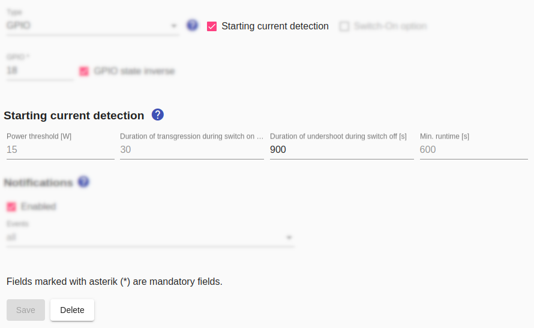

# Starting current detection

Many devices cannot simply be switched on in order to start working immediately afterwards, but must first be programmed after switching on. This requires that the device is also supplied with power during this time. When using the inrush current detection of the *Smart Appliance Enabler*, the power supply to the device is only interrupted in the time between detecting the inrush current and receiving the switch-on recommendation from the *Sunny Home Manager*.

A prerequisite for using the starting current detection is therefore passing the following test:

_Simply plug the device into a standard live outlet. Switch on the device and start the program. After 1-2 minutes pull the plug. After another minute, plug the connector back in. If the program continues without a key being pressed, the device is eligible to use the *Smart Appliance Enabler* inrush current detection._

The **starting current detection** consists in distinguishing between the switched-on device in idle state and the switched-on device that is currently doing its work. The transition from the former state to the latter state is detected when power consumption remains above a configurable limit (default: 15W) for a configurable time (default: 30 seconds).

Likewise, the **finish current** will be recognized as a transition back if the power consumption remains below this configurable limit for a configurable time (default: 5 minutes). So that the cut-off current is not incorrectly detected shortly after the start-up current has been detected, the cut-off current detection begins with a delay (default: 10 minutes).



After detection of the finish current, the starting current detection is reactivated immediately. This makes it possible to run the device several times in succession within a [Schedule](Schedules_EN.md).

## Log
If the starting current is detected, there is a corresponding entry in the log:

```console
$ grep "Starting current detected" /tmp/rolling-2021-01-08.log
2021-01-08 10:43:57,469 DEBUG [pi4j-gpio-event-executor-2] d.a.s.c.StartingCurrentSwitch [StartingCurrentSwitch.java:298] F-00000001-000000000012-00: Starting current detected.
```

*Webmin*: In [View Logfile](Logging_EN.md#user-content-webmin-logs) enter `Starting current detected` after `Only show lines with text` and press Refresh.

Accordingly, there is also an entry in the log as soon as the finish current has been detected:

```console
$ grep "Finished current detected" /tmp/rolling-2021-01-08.log
2021-01-08 13:04:25,374 DEBUG [Timer-0] d.a.s.c.StartingCurrentSwitch [StartingCurrentSwitch.java:316] F-00000001-000000000012-00: Finished current detected.
```

*Webmin*: In [View Logfile](Logging_EN.md#user-content-webmin-logs) enter `Finished current detected` after `Only show lines with text` and press Refresh.
