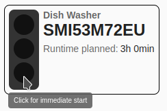
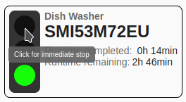
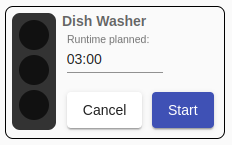
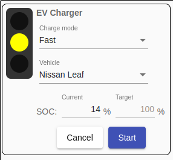
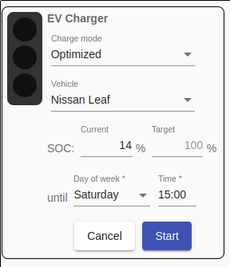
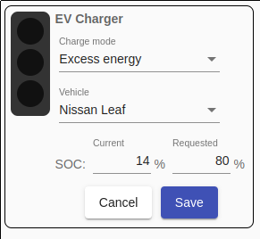
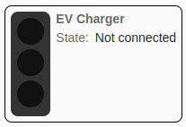
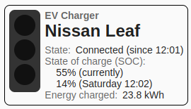
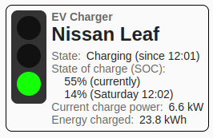

# Status
## Display
When opening the web application or by clicking on the menu item `Status` you get to the status page.

The status page shows the status of each controllable appliance with a **traffic light** so that you can see the status immediately:

For devices with activated [Starting CurrentDetection](StartingCurrentDetection_EN.md), the traffic light changes to red or yellow depending on the schedule and the current time as soon as the starting current has been detected.

##  Manual switching

The traffic light also enables **manual switching** of appliances. With a **click on the green lamp**, the device can be switched on immediately, regardless of configured schedules:

A click on the red lamp causes the appliance to be switched off, whereby the *Sunny Home Manager* also prevents it from being switched on again for the active timeframe.

The planned runtime must be entered so that the *Smart Appliance Enabler* can communicate this to the *Sunny Home Manager*. If a schedule exists for the device, the input field is pre-assigned its value for runtime.

By clicking on the `Start` button, the device is switched on immediately.

##  Special features for wallboxes

After a **click on the green traffic light** you can set the `charge mode` for the current charge process.

Depending on the `charge mode` selected, the fields `SOC: Current` and/or `SOC: Target` are displayed, where the following applies:
- if a [SOC-Script](soc/SOC_EN.md) was specified for the selected vehicle, the input field `SOC: Current` is pre-assigned with the current value at this point in time. Without the SOC script, it can be read in the car and entered here if you want to enable the *Sunny Home Manager* to plan well. Otherwise 0 is assumed and a correspondingly high energy demand is reported.
- If no value is entered in the `SOC: Target` input field, 100% is assumed and a correspondingly high energy requirement is reported to the *Sunny Home Manager*.

### Charge mode: fast
The charge process starts immediately with maximum power. There is no optimization with regard to electricity costs and the use of PV electricity.

### Charge mode: optimized
The charger runs on as much excess PV power as possible. This ensures that the specified SOC is reached at the specified time, if necessary by drawing electricity from the grid. After that, the system automatically switches to charge mode "Excess energy".

### Charge mode: excess energy
The vehicle is charged with excess PV power that would otherwise be fed into the grid or curtailed. This charge mode is automatically active as soon as the vehicle is connected to the charger and as long as no other charging mode has been activated. In this respect, the selection of this charging mode only serves to set a target SOC that deviates from the values set in the vehicle configuration. Using this charge mode, the charging of the vehicle cannot be guaranteed. If excess energy is not sufficient for charging, no charging takes place.

### Status display
If the vehicle is not connected to the wall box, only the status is displayed:

After the vehicle has been connected, further details are displayed. The SOC is displayed with "0%" if no [SOC script](#vehicles) has been configured.

If a charging process is active, the status display looks like this:

After a status change (start of charging, end of charging), the status is only displayed correctly if the duration configured for `Start state detection delay` (default value: 30s) has expired.
