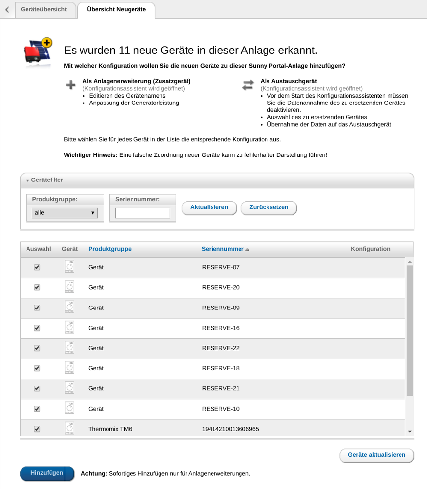

# Sunny Home Manager

## Hinzugfügen neuer Geräte in den Sunny Home Manager (SHM)

Zum Hinzufügen neuer Geräte in den Sunny Home Manager muss auf der Seite
```
Konfiguration -> Geräteübersicht -> Tab: Übersicht Neugeräte
```
der Button ```Geräte aktualisieren``` gedrückt werden. Danach sollte das neu konfigurierte Gerät angezeigt werden:


Durch Drücken des ```[+]```-Buttons wird das Gerät hinzugefügt.
Im ersten Schritt kann der Gerätename festgelegt werden - die Vorgabe kommt aus der Konfiguration des Gerätes im *Smart Appliance Enabler*:


Im zweiten Schritt wird lediglich eine Zusammenfassung angezeigt:


Nach Drücken von ```Fertigstellen``` wird noch eine Bestätigung angezeigt, dass das Gerät hinzugefügt wurde.

Der SHM fragt den *Smart Appliance Enabler* alle 60 Sekunden nach dem Status der verwaltenden Geräte zugehörigen Schaltzeiten. In der [Log-Datei](Support.md#Log) sollten für jede Abfrage in etwa folgende Zeilen stehen: 
```
2019-03-30 00:00:55,154 DEBUG [http-nio-8080-exec-5] d.a.s.s.w.SempController [SempController.java:55] Device info/status/planning requested.
2019-03-30 00:00:55,156 DEBUG [http-nio-8080-exec-5] d.a.s.s.w.SempController [SempController.java:218] F-00000001-000000000001-00: Reporting device status based on power consumption
2019-03-30 00:00:55,158 DEBUG [http-nio-8080-exec-5] d.a.s.s.w.SempController [SempController.java:229] F-00000001-000000000001-00: DeviceStatus{eMSignalsAccepted=false, status=Off, errorCode=null}
2019-03-30 00:00:55,160 DEBUG [http-nio-8080-exec-5] d.a.s.s.w.SempController [SempController.java:233] F-00000001-000000000001-00: Reporting power info from meter.
2019-03-30 00:00:55,161 DEBUG [http-nio-8080-exec-5] d.a.s.m.PulseElectricityMeter [PulseElectricityMeter.java:234] F-00000001-000000000001-00: 0 timestamps in measurement interval
2019-03-30 00:00:55,163 DEBUG [http-nio-8080-exec-5] d.a.s.m.PulseElectricityMeter [PulseElectricityMeter.java:125] F-00000001-000000000001-00: Not switched on.
2019-03-30 00:00:55,173 DEBUG [http-nio-8080-exec-5] d.a.s.s.w.SempController [SempController.java:251] F-00000001-000000000001-00: PowerInfo{averagePower=0, minPower=0, maxPower=0, timestamp=0, averagingInterval=60}
2019-03-30 00:00:55,174 DEBUG [http-nio-8080-exec-5] d.a.s.s.w.SempController [SempController.java:274] F-00000001-000000000001-00: No planning requests created
```

In der Verbraucherbilanz sollte ab jetzt das neue Gerät aufgeführt werden mit seinem Verbrauch:


## Maximale Anzahl der Geräte im Sunny Portal

Aktuell unterstützt der Sunny Home Manager *maximal 12 Geräte*. Zur Gesamtzahl zählen neben den Geräten, die mit dem SEMP Protokoll angesprochen werden, auch z.B. SMA Bluetooth Funksteckdosen - also alle Geräte, die im Sunny Portal in der Verbraucherübersicht angezeigt werden. Dieses Limit läßt sich auf 22 anheben, wenn man alle Geräte auf einmal anlegt, solange man weniger als 12 Geräte im *Sunny Portal* anlegt hat. Noch nicht benötige Geräte legt man dann einfach als Platzhalter an und ändert einfach die Daten, wenn man tatsächlich ein Gerät anstatt des Platzhalter haben möchte. Wenn man mehr als 12 Geräte im *Sunny Portal*, darf man die Geräte dort nicht inaktiv setzen, da sie sich nicht wieder aktivieren lassen. Stattdessen sollte man nur die Konfiguration im *Smart Appliance Enabler* entsprechend anpassen.

Um die Geräte auf einmal anzulegen, muss man in der ```Übersicht Neugeräte```, alle neuen Geräte auswählen und dann den ```Hinzufügen```-Button drücken. 

Quelle: https://www.photovoltaikforum.com/thread/104060-ger%C3%A4te-mit-home-manager-koppeln-via-semp-ethernet/?postID=1774797#post1774797


