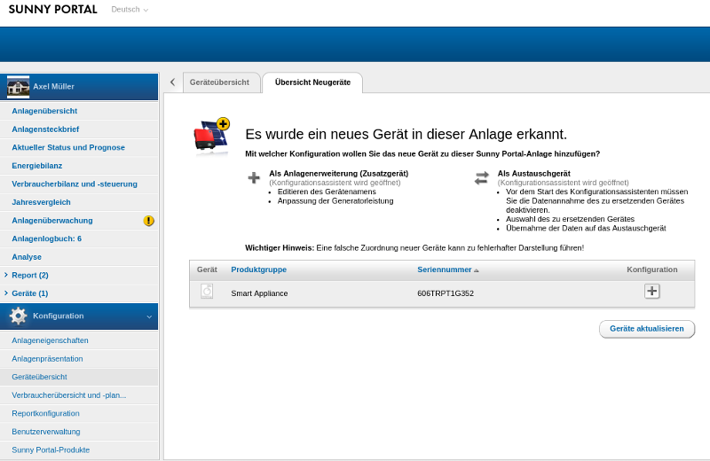
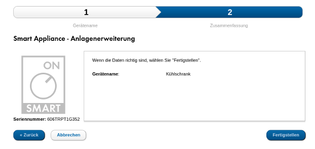
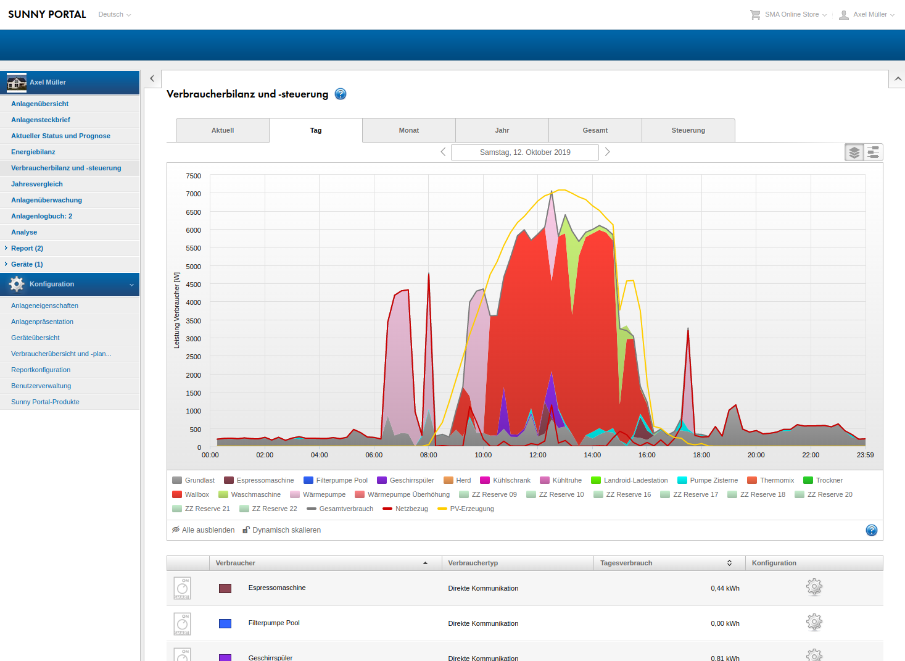
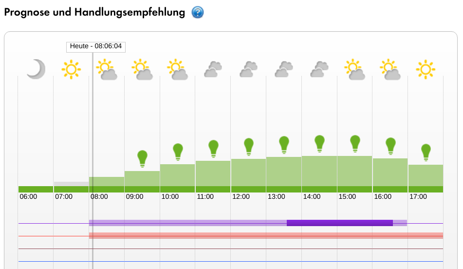

# Sunny Portal
## Adding new devices in Sunny Portal
Before the *Sunny Home Manager* can control or measure a device, it must be added to the [Sunny Portal](https://www.sunnyportal.com/).

To do this there on the page
```
Configuration -> Device overview -> Tab: Overview of new devices
```
the `Update devices` button must be pressed.

After that, the new device should appear:



The device is added by pressing the `[+]` button.

In the first step, the device name can be specified - the default comes from the configuration of the device in the *Smart Appliance Enabler*:


In the second step, only a summary is displayed:



After pressing `Finish` you will see another confirmation that the device has been added.

If you get the error message instead

> The device found by your Sunny Home Manager with the serial number ... is already registered in another system and therefore cannot be added to your system.

... the ID you selected for the device is already assigned and another [ID configured](Appliance_EN.md#id) must be configured. Then you have to add the device again in the *Sunny Portal*.

### <a name="max-devices"></a> Maximum number of devices in Sunny Portal

The Sunny Home Manager currently supports *a maximum of 12 devices*. In addition to the devices that are addressed with the SEMP protocol, the total number also includes, for example, SMA Bluetooth radio-controlled sockets - i.e. all devices that are displayed in the consumer overview in Sunny Portal.

## Load balance and control
From now on, the new device should be listed in the *Load balance and control* with its consumption:



If the *Smart Appliance Enabler* transmits timeframes for devices, these are displayed (approx. 10-15 minutes later) under *Forecast and recommended action*:



The possible time window is displayed transparently (in the picture the purple bar 8:00 to 17:00), while the planned running time is not transparent (in the picture the purple bar approx. 13:30 to 16:30).
The complete bar is transparent if the device only wants to consume excess energy (in the picture the orange bar for a wallbox).
