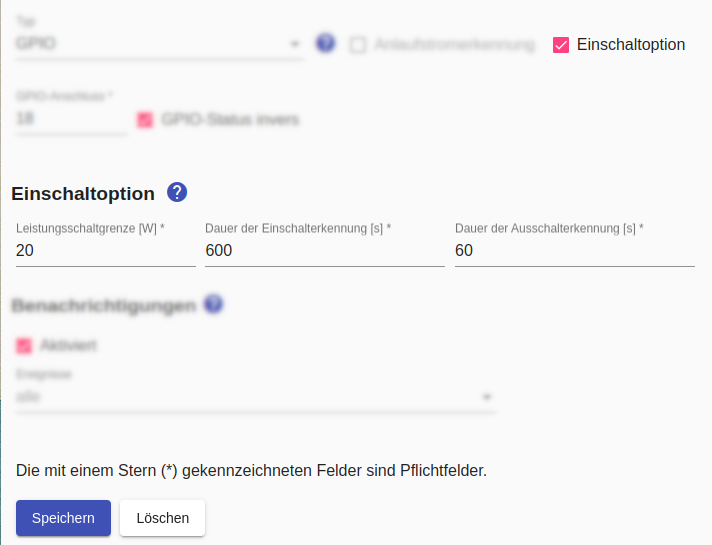
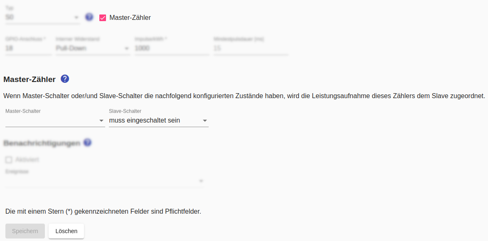

# Einschaltoption
Die Einschaltoption kann dazu verwendet werden, die [SG-Ready-Funktion von Wärmepumpen](https://www.waermepumpe.de/normen-technik/sg-ready/) optimial zu unterstützen.

Das Schalten des SG-Ready-Eingangs entspricht einem Angebot an die Wärmepumpe, das diese nicht annehmen muss. Damit eine Nicht-Annahme der Einschaltoption nicht dazu führt, dass andere Geräte unter Kontrolle des *Sunny Home Manager* unnötig ausgebremst werden, führt die Nicht-Annahme der Einschaltoption innerhalb einer bestimmten Zeit dazu, dass das aktuelle Zeitfenster freigegeben wird.



Dazu müssen **Wärmepumpe und SG-Ready jeweils als eigenständiges Gerät** im *Smart Appliance Enabler* angelegt werden.

Beide Geräte teilen sich einen physischen Zähler, der im *Smart Appliance Enabler* als [Master/Slave-Zähler](MasterSlaveMeter_DE.md) beiden Geräten zugeordnet ist. Der Master-Zähler muss so konfiguriert sein, dass die Leistungsaufnahme dem Slave zugeordnet wird, wenn der Slave-Schalter eingeschaltet ist:



Der Schalter des Gerätes _Wärmepumpe_  schaltet und/oder signalisiert den Schaltzustand der Wärmepumpe während der Schalter des Gerätes _SG-Ready-Eingang_ den SG-Ready-Eingang schaltet.

Für die SG-Ready-Funktion wird ein [Zeitplan mit Überschussenergie](Schedules_DE.md) verwendet, welcher im *Smart Appliance Enabler* dem Gerät _SG-Ready-Eingang_ zugewiesen sein muss.

Sobald ein Einschaltbefehl für das Gerät _SG-Ready-Eingang_ vom *Sunny Home Manager* empfangen wird, wird der SG-Ready-Eingang geschaltet. Wenn innerhalb der **Dauer der Einschalterkennung** die Leistungsaufname des Gerätes _Wärmepumpe_ den in der **Leistungsschaltgrenze** angegebenen Wert übersteigt, wird dies als Einschalten des Gerätes erkannt und das Zeitfenster, welches zum Einschalten des SG-Ready-Eingangs geführt hat, bleibt aktiv. Andernfalls wird nach Ablauf der **Dauer der Einschalterkennung** das aktuelle Zeitfenster freigegeben.

Nachdem das Einschalten des Gerätes _Wärmepumpe_ erkannt wurde, ist die Ausschalterkennung aktiv. Das bedeutet, dass das Ausschalten des Gerätes _Wärmepumpe_ erkannt wird, sobald die Leistungsaufnahme für die **Dauer der Ausschalterkennung** unterhalb der **Leistungsschaltgrenze** bleibt. Wenn das Ausschalten erkannt wurde, wird das aktuelle Zeitfenster freigegeben.

## Log
Wird für den Schalter des Gerätes _SG-Ready-Eingang_ ein Einschaltbefehl vom *Sunny Home Manager* empfangen, finden sich im Log Einträge, die das Einschalten des Gerätes _SG-Ready-Eingang_ und das nachfolgende Warten auf das Einschalten des Gerätes _Wärmepumpe_ zeigen :

```bash
$ grep SwitchOnOption /tmp/rolling-2022-10-23.log
2022-10-23 10:20:09,450 DEBUG [MQTT Call: F-00000001-000000000008-00-SwitchOnOption-0] d.a.s.c.SwitchOnOption [SwitchOnOption.java:113] F-00000001-000000000008-00: Setting switch state to on
2022-10-23 10:20:09,452 DEBUG [MQTT Call: F-00000001-000000000008-00-SwitchOnOption-0] d.a.s.c.WrappedControl [WrappedControl.java:211] F-00000001-000000000008-00: Setting wrapped appliance switch to on
2022-10-23 10:20:10,172 DEBUG [MQTT Call: F-00000001-000000000008-00-SwitchOnOption-0] d.a.s.c.SwitchOnOption [SwitchOnOption.java:66] F-00000001-000000000008-00: on=true averagePower=0
2022-10-23 10:20:10,175 DEBUG [MQTT Call: F-00000001-000000000008-00-SwitchOnOption-0] d.a.s.c.WrappedControl [WrappedControl.java:190] F-00000001-000000000008-00: power value cache: min=0W max=0W values=37 maxAge=900s
2022-10-23 10:20:10,176 DEBUG [MQTT Call: F-00000001-000000000008-00-SwitchOnOption-0] d.a.s.c.SwitchOnOption [SwitchOnOption.java:94] F-00000001-000000000008-00: Switch on not detected.
2022-10-23 10:20:30,178 DEBUG [MQTT Call: F-00000001-000000000008-00-SwitchOnOption-0] d.a.s.c.SwitchOnOption [SwitchOnOption.java:66] F-00000001-000000000008-00: on=true averagePower=0
2022-10-23 10:20:30,182 DEBUG [MQTT Call: F-00000001-000000000008-00-SwitchOnOption-0] d.a.s.c.WrappedControl [WrappedControl.java:190] F-00000001-000000000008-00: power value cache: min=0W max=0W values=38 maxAge=900s
2022-10-23 10:20:30,187 DEBUG [MQTT Call: F-00000001-000000000008-00-SwitchOnOption-0] d.a.s.c.SwitchOnOption [SwitchOnOption.java:94] F-00000001-000000000008-00: Switch on not detected.
2022-10-23 10:20:50,177 DEBUG [MQTT Call: F-00000001-000000000008-00-SwitchOnOption-0] d.a.s.c.SwitchOnOption [SwitchOnOption.java:66] F-00000001-000000000008-00: on=true averagePower=0
2022-10-23 10:20:50,182 DEBUG [MQTT Call: F-00000001-000000000008-00-SwitchOnOption-0] d.a.s.c.WrappedControl [WrappedControl.java:190] F-00000001-000000000008-00: power value cache: min=0W max=0W values=39 maxAge=900s
2022-10-23 10:20:50,185 DEBUG [MQTT Call: F-00000001-000000000008-00-SwitchOnOption-0] d.a.s.c.SwitchOnOption [SwitchOnOption.java:94] F-00000001-000000000008-00: Switch on not detected.
2022-10-23 10:21:10,181 DEBUG [MQTT Call: F-00000001-000000000008-00-SwitchOnOption-0] d.a.s.c.SwitchOnOption [SwitchOnOption.java:66] F-00000001-000000000008-00: on=true averagePower=0
```

*Webmin*: In [View Logfile](Logging_DE.md#user-content-webmin-logs) gibt man hinter `Only show lines with text` den Text `SwitchOnOption` ein und drückt Refresh.

Wenn das Gerät _Wärmepumpe_ nicht innerhalb der **Dauer der Einschalterkennung** eingeschaltet hat, findet sich folgender Eintrag im Log:

```bash
$ grep SwitchOnOption /tmp/rolling-2022-10-23.log
2022-10-23 10:35:30,193 DEBUG [MQTT Call: F-00000001-000000000008-00-SwitchOnOption-0] d.a.s.c.SwitchOnOption [SwitchOnOption.java:82] F-00000001-000000000008-00: No switch on detected within switchOnDetectionDuration=900s. Removing timeframe interval.
```

*Webmin*: In [View Logfile](Logging_DE.md#user-content-webmin-logs) gibt man hinter `Only show lines with text` den Text `SwitchOnOption` ein und drückt Refresh.
