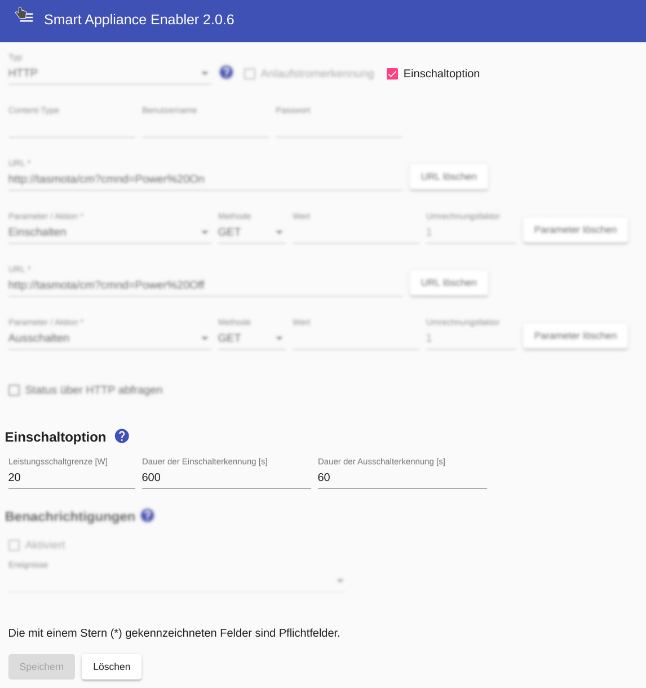
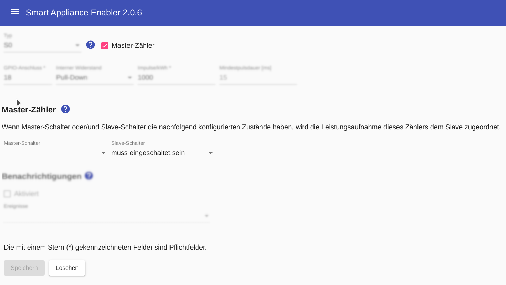

# Switch-on option

The switch-on option can be used to optimally support the [SG-Ready function of heat pumps](https://www.waermepumpe.de/normen-technik/sg-ready/).

Switching the SG-Ready input corresponds to an offer to the heat pump that does not have to accept it. So that non-acceptance of the switch-on option does not result in other devices under the control of the *Sunny Home Manager* being slowed down unnecessarily, non-acceptance of the switch-on option within a certain period of time results in the current time window being released.



To do this, the **heat pump and SG-Ready must each be created as an independent device** in the *Smart Appliance Enabler*.

Both devices share a physical meter that is assigned to both devices in the *Smart Appliance Enabler* as [Master/Slave Meter](MasterSlaveMeter_EN.md). The master meter must be configured so that the power consumption is allocated to the slave when the slave switch is on:



The switch on the _Heat pump_ device switches and/or signals the switching status of the heat pump, while the switch on the _SG-Ready-Input_ device switches the SG-Ready input.

For the SG-Ready function, a [Schedule with excess energy](Schedules_EN.md) is used, which must be assigned to the device _SG-Ready-Input_ in the *Smart Appliance Enabler*.

As soon as a switch-on command for the _SG-Ready-Input_ device is received from the *Sunny Home Manager*, the SG-Ready input is switched. If the power consumption of the _heat pump_ device exceeds the value specified in the **power switching limit** within the **duration of the switch-on detection**, this is recognized as switching on the device and the time window that led to the switching on of the SG-Ready input is remains active. Otherwise, the current time window is released after the **duration of switch-on detection** has expired.

After switching on the device _Heat pump_ has been detected, the switch-off detection is active. This means that the switching off of the _heat pump_ device is detected as soon as the power consumption remains below the **power switching limit** for the **duration of the switch-off detection**. If the switch-off has been detected, the current time window is released.

## Log
If a switch-on command is received from the *Sunny Home Manager* for the switch of the _SG-Ready-Input_ device, the log contains entries that show the _SG-Ready-Input_ device being switched on and subsequent waiting for the _Heat pump_ device to be switched on:

```console
$ grep SwitchOption /tmp/rolling-2022-10-23.log
2022-10-23 10:20:09,450 DEBUG [MQTT Call: F-00000001-000000000008-00-SwitchOption-0] d.a.s.c.SwitchOption [SwitchOption.java:113] F-00000001-000000000008-00: Setting switch state to on
2022-10-23 10:20:09,452 DEBUG [MQTT Call: F-00000001-000000000008-00-SwitchOption-0] d.a.s.c.WrappedControl [WrappedControl.java:211] F-00000001-000000000008-00: Setting wrapped appliance switch to on
2022-10-23 10:20:10,172 DEBUG [MQTT Call: F-00000001-000000000008-00-SwitchOption-0] d.a.s.c.SwitchOption [SwitchOption.java:66] F-00000001-000000000008-00: on=true averagePower=0
2022-10-23 10:20:10,175 DEBUG [MQTT Call: F-00000001-000000000008-00-SwitchOption-0] d.a.s.c.WrappedControl [WrappedControl.java:190] F-00000001-000000000008-00: power value cache: min=0W max=0W values=37 maxAge=900s
2022-10-23 10:20:10,176 DEBUG [MQTT Call: F-00000001-000000000008-00-SwitchOption-0] d.a.s.c.SwitchOption [SwitchOption.java:94] F-00000001-000000000008-00: Switch on not detected.
2022-10-23 10:20:30,178 DEBUG [MQTT Call: F-00000001-000000000008-00-SwitchOption-0] d.a.s.c.SwitchOption [SwitchOption.java:66] F-00000001-000000000008-00: on=true averagePower=0
2022-10-23 10:20:30,182 DEBUG [MQTT Call: F-00000001-000000000008-00-SwitchOption-0] d.a.s.c.WrappedControl [WrappedControl.java:190] F-00000001-000000000008-00: power value cache: min=0W max=0W values=38 maxAge=900s
2022-10-23 10:20:30,187 DEBUG [MQTT Call: F-00000001-000000000008-00-SwitchOption-0] d.a.s.c.SwitchOption [SwitchOption.java:94] F-00000001-000000000008-00: Switch on not detected.
2022-10-23 10:20:50,177 DEBUG [MQTT Call: F-00000001-000000000008-00-SwitchOption-0] d.a.s.c.SwitchOption [SwitchOption.java:66] F-00000001-000000000008-00: on=true averagePower=0
2022-10-23 10:20:50,182 DEBUG [MQTT Call: F-00000001-000000000008-00-SwitchOption-0] d.a.s.c.WrappedControl [WrappedControl.java:190] F-00000001-000000000008-00: power value cache: min=0W max=0W values=39 maxAge=900s
2022-10-23 10:20:50,185 DEBUG [MQTT Call: F-00000001-000000000008-00-SwitchOption-0] d.a.s.c.SwitchOption [SwitchOption.java:94] F-00000001-000000000008-00: Switch on not detected.
2022-10-23 10:21:10,181 DEBUG [MQTT Call: F-00000001-000000000008-00-SwitchOption-0] d.a.s.c.SwitchOption [SwitchOption.java:66] F-00000001-000000000008-00: on=true averagePower=0
```

*Webmin*: In [View Logfile](Logging_EN.md#user-content-webmin-logs) enter `SwitchOption` after `Only show lines with text` and press Refresh.

If the device _Heat pump_ has not switched on within the **duration of the switch-on detection**, the following entry is made in the log:
```console
$ grep SwitchOption /tmp/rolling-2022-10-23.log
2022-10-23 10:35:30,193 DEBUG [MQTT Call: F-00000001-000000000008-00-SwitchOption-0] d.a.s.c.SwitchOption [SwitchOption.java:82] F-00000001-000000000008-00: No switch on detected within switchOnDetectionDuration=900s. Removing timeframe interval.
```

*Webmin*: In [View Logfile](Logging_EN.md#user-content-webmin-logs) enter `SwitchOption` after `Only show lines with text` and press Refresh.
