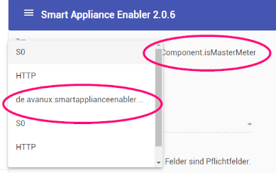

# Update
## Allgemeine Hinweise
Teil des *Smart Appliance Enabler* ist die Web-Anwendung, die im Rahmen des Updates ebenfalls aktualisiert wird. In Abhängigkeit von den Einstellungen im verwendeten Web-Browser kann es sein, dass nach dem Update die Web-Oberfläche nicht richtig angezeigt wird und sich "komisch" verhält. 



In diesem Fall muss der Cache des Web-Browser für die URL des *Smart Appliance Enabler* oder möglicherweise komplett gelöscht werden. Danach sollte die Web-Anwendung wie gewohnt funktionieren.

## Update bei gleichbleibender Hauptversion (1.x -> 1.x, 2.x -> 2.x)
Das Update der installierten Version des *Smart Appliance Enabler* besteht im Austausch der `SmartApplianceEnabler-*.war`-Datei im Verzeichnis `/opt/sae`. **Dabei ist zu beachten, das sich im Verzeichnis immer nur eine Datei mit der Erweiterung `.war` befindet!** Damit man ggf. auf die alte Version zurückwechseln kann, kann man diese umbenennen beispielsweise in `SmartApplianceEnabler-1.6.19.war.old` anstatt sie zu löschen.

Vor einem Update sollten unbedingt Kopien der [Konfigurationsdateien](ConfigurationFiles_DE.md) erstellt werden, weil diese beim Start der neuen Version automatisch aktualisiert werden und mit diesen ein Zurückwechseln auf die bisher genutzte Version voraussichtlich nicht möglich ist.  

### Download der neuen Version
Die zum Download bereitstehenden Versionen des *Smart Appliance Enabler* finden sich auf der [Projekt-Seite im Bereich Releases](https://github.com/camueller/SmartApplianceEnabler/releases).

### Durchführung des Updates
Die neue `SmartApplianceEnabler-*.war`-Datei kopiert man mit `scp` auf den Raspberry Pi in das Verzeichnis `/opt/sae`. Der Login sollte dabei mit dem User `sae` erfolgen, damit die Datei als Owner und Group gleich `sae` erhält.

*Webmin*: Mit der [Dateiverwaltung von webmin](Webmin_DE.md) kann man ebenfalls die Datei auf den Raspberry Pi kopieren und auch eine bereits vorhanden Datei umbenennen oder löschen. Das Erstellen von Kopien von Dateien erfolgt mit den Menüpunkten "Copy" und "Paste". 

### Starten der aktualisierten Version
Nachdem die zu verwendende `SmartApplianceEnabler-*.war`-Datei platziert worden ist, muss der *Smart Appliance Enabler*-Prozess neu gestartet werden. Das passiert mit folgendem Befehl:

```bash
$ sudo systemctl restart smartapplianceenabler.service
```

*Webmin*: Mit der [Dienstverwaltung von webmin](Webmin_DE.md) kann der *Smart Appliance Enabler* ebenfalls restarted werden. 

## Update von Version 1.6 auf Version 2.x
### Automatisiertes Update
Voraussetzungen für das automatiserte Update sind:
- Raspberry Pi
- SSH-Shell oder `webmin`
- nicht-virtualisierte Standard-Installation des *Smart Appliance Enabler*

**Achtung: Der Update-Prozess darf unter keinen Umständen unterbrochen werden, sobald er gestartet wurde!** 

Zum Durchführen des Updates muss man entweder per SSH oder `webmin` als User "pi" eingeloggt sein. Bei Verwendung von `webmin` muss zur Eingabe der nachfolgenden Befehle der [Menüpunkt `Command Shell`](Webmin_DE.md) ausgewählt werden.

Zunächst muss die Konfigurationsdatei heruntergeladen werden:

```bash
$ sudo curl \
    -sSL \
    https://raw.githubusercontent.com/camueller/SmartApplianceEnabler/master/install/install.config \
    --output /usr/local/etc/install.config
```

Danach wird das Update wie folgt gestartet:

```bash
$ curl \
    -sSL \
    https://raw.githubusercontent.com/camueller/SmartApplianceEnabler/master/install/upgrade.sh | sudo sh
```

Dabei wird das eigentliche Update-Script [upgrade2.sh](https://raw.githubusercontent.com/camueller/SmartApplianceEnabler/master/install/upgrade2.sh) heruntergeladen und zur Ausführung beim Systemstart (in `/etc/rc.local`) registriert. Danach wird ein Neustart ausgelöst, d.h. nachdem der Raspberry Pi den Bootvorgang beendet hat, muss man sich erneut per SSH verbinden oder `webmin` erneut laden. Dabei sollte man mit `webmin` geduldig sein, weil durch Netzwerkverkehr und/oder Systemlast die Nutzbarkeit temporär eingeschränkt sein kann.

Ist man per SSH auf dem Raspberry Pi eingeloggt, lässt sich in der Console der Fortschritt des Updates mit `tail -f /tmp/install.log` verfolgen. Auch in `webmin` kann man den Fortschritt des Updates verfolgen - siehe [Log Dateien anzeigen](Webmin_DE.md), wobei als Log-Datei `/tmp/install.log` eingegeben werden muss.

Zu Beginn des Updates erfolgt das **Update des Raspberry Pi OS auf "Bullseye"**, falls noch eine ältere Version installiert ist. Selbst bei schneller Internet-Anbindung kann dieses OS-Update auch auf einem Raspberry Pi 4 eine Stunde oder länger dauern! Nach dem OS-Update wird der Raspberry Pi neu gestartet.

Wenn das Raspberry Pi OS die Version "Bullseye" hat, werden zuerst die [Konfigurationsdateien des *Smart Appliance Enabler*](ConfigurationFiles_DE.md) und auch die `SmartApplianceEnabler-*.war`-Datei gesichert (mit Dateiendung `.bak`). Danach wird das eigentliche Update des *Smart Appliance Enabler* inklusive der Installation der benötigten Packages durchgeführt. Auch der MQTT-Broker `mosquitto` wird automatisch installiert und konfiguriert.

Wenn das Update beendet ist, wird die **rote LED für eine Stunde ausgeschaltet**.

### Manuelles Update
Das manuelle Update sollte nur dann ausgeführt werden, wenn:
- kein Raspberry Pi verwendet wird
- und eine nicht-virtualisierte Installation des *Smart Appliance Enabler* verwendet wird

#### pigpiod
Falls GPIO verwendet werden soll (nur auf Raspberry Pi) muss [pigpiod installiert werden](InstallationManual_DE.md#pigpiod-installieren).

In der Datei `/etc/default/smartapplianceenabler` müssen folgende Zeile hinzugefügt werden:

```bash
# Configure pigpioj to use pigpiod daemon in order to avoid forcing the Smart Appliance Enabler to run as root
JAVA_OPTS="${JAVA_OPTS} -DPIGPIOD_HOST=localhost"
```

#### MQTT-Broker
**Ohne MQTT-Broker ist SAE 2.0 nicht lauffähig**. Theoretisch sollte jeder vorhandene MQTT-Broker funktionieren, aber in der Praxis scheint das nicht so zu sein. Im Zweifel sollte der MQTT-Broker [Mosquitto installiert](InstallationManual_DE.md#mqtt-broker) werden.

Wenn der MQTT-Broker nicht über `localhost:1883` erreichbar ist oder Benutzername/Passwort notwendig sind, müssen diese Parameter in den Einstellungen des *Smart Appliance Enabler* konfiguriert werden. Solange diese nicht konfiguriert sind, ist zwar die Web-Oberfläche des SAE nutzbar, aber es werden **keine Daten an den SHM übermittelt oder Schaltbefehle von diesem ausgeführt**.

#### Konfigurationsdateien
Es wird dringend empfohlen, die Konfigurationsdatei `Appliances.xml` vor dem Update für den Fall zu sichern, dass man doch wieder zurück auf die Version 1.6 wechseln möchte. Sobald im *Smart Appliance Enabler* 2.0 eine Änderung gespeichert wird, führt das zum Überschreiben der Datei `Appliances.xml`, wodurch diese nicht mehr für den *Smart Appliance Enabler* 1.6 lesbar ist.

#### Update der installierten Version des *Smart Appliance Enabler*
Das Update des *Smart Appliance Enabler* erfolgt durch [Austausch der war-Datei wie oben auf dieser Seite beschrieben](#durchf%C3%BChrung-des-updates).

### Docker
Die [Docker-Compose-Datei](https://raw.githubusercontent.com/camueller/SmartApplianceEnabler/master/run/etc/docker/compose/docker-compose.yml) wurde angepasst und startet vor dem *Smart Appliance Enabler* jeweils einen Container mit `pigpiod` und `mosquitto`.

Ansonsten muss lediglich das Docker-Image in der gewünschten Version verwendet werden.
