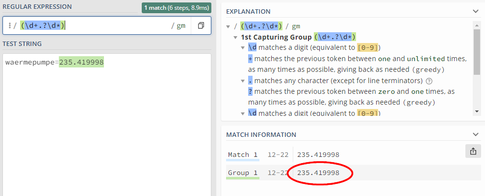
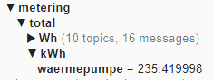
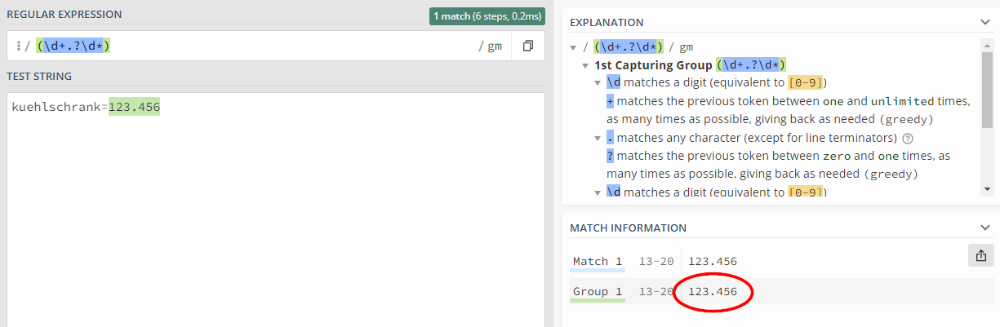

# Wert-Extraktion 
Bei Abfragen erhält der *Smart Appliance Enabler* oft eine umfangreiche Antwort (XML, JSON, ...), aus welcher der eigentliche Zahlenwert erst extrahiert werden muss.

Dazu kann an diversen Stellen im *Smart Appliance Enabler* entweder ein (JSON-) Pfad (Feldname `Pfad für Extraktion`) oder ein regulärer Ausdruck (Feldname `Regex für Extraktion`) konfiguriert werden.

## Mit JSON-Pfad
Diese Methode zur Wert-Extraktion funktioniert nur, wenn die Antwort im JSON-Format vorliegt!

Ob eine Antwort im JSON-Format vorliegt, lässt sich recht gut an den geschweiften Klammern erkennen, welche deren Struktur bestimmen. 

Der JSON-Pfad lässt sich relativ einfach mit dem [JSON Path Finder](https://jsonpathfinder.com/) betimmen: Einfach das JSON auf der _linken Seite_ einfügen (kann aus dem Log entnommen werden, wenn der *Smart Appliance Enabler* bereits mit diesem Gerät kommuniziert). Danach kann man auf der _rechten Seite_ die Datenstruktur aufklappen und den gewünschten Wert selektieren. Der jeweilige JSON-Pfad (englisch: path) wird dann oberhalb angezeigt, beginnend mit `x`. Bei der Übernahme des Pfades in den *Smart Appliance Enabler* muss dieses `x` durch ein `$` ersetzt werden.


Für obiges Beispiel muss im *Smart Appliance Enabler* konfiguriert werden:

`Pfad für Extraktion`: `$.StatusSNS.ENERGY.Power`

Damit der *Smart Appliance Enabler* weiss, dass die Antwort als JSON interpretiert werden soll, muss ausserdem als `Format` `JSON` angegeben werden!

## Mit regulärem Ausdruck

Die Wert-Extraktion mit einem [regulären Ausdruck](http://www.regexe.de/hilfe.jsp) funktioniert immer. Allerdings erschliesst sich deren Formulierung nicht jedem sofort. 

Zum Testen, ob der gewählte reguläre Ausdruck den gewünschten Wert aus der Antwort extrahiert, eignet sich die Webseite [RegEx101](https://regex101.com/). Der Vorteil dieses Testers ist, dass er direkt während der Eingabe evaluiert.

Ausser dem regulären Ausdruck benötigt man die Antwort, aus welcher der Wert extrahiert werden soll. Wenn der *Smart Appliance Enabler* bereits mit diesem Gerät kommuniziert, kann dessen Antwort dem Log entnommen werden.

### Beispiel für RegEx-Anwendung auf JSON-Daten 

Die kursiv dargestellten Bezeichnungen beziehen sich auf die entsprechenden Felder der Regex-Tester-Seite.

_Regular Expression_: `.*"Power":(\d+).*`

_Test Text_:

```json
{"StatusSNS":{"Time":"2019-09-06T20:06:19","ENERGY":{"TotalStartTime":"2019-08-18T11:07:55","Total":0.003,"Yesterday":0.000,"Today":0.003,"Power":26,"ApparentPower":25,"ReactivePower":25,"Factor":0.06,"Voltage":239,"Current":0.106}}}
```

Im rechten Teil des Fenster wird im oberen Teil direkt erklärt, was genau die einzelnen Teile der RegEx bewirken und im mittleren Teil das Ergebnis angzeigt.



Der Wert 26 wurde also erfolgreich mit obigem regulären Ausdruck aus der Antwort extrahiert.

**Wenn ein regulärer Ausdruck konfiguriert wird, sollte im *Smart Appliance Enabler* als `Format` kein Wert konfiguriert werden!**

Im *Smart Appliance Enabler* muss für dieses Beispiel konfiguriert werden:

`Regex für Extraktion`: `.*"Power":(\d+).*`

`Format`: leer lassen

### Beispiel für RegEx-Anwendung auf Key-Value-Daten

Liegen die auszuwertenden Daten als Key-Value-Paare vor, so muss beachtet werden, dass der reguläre Ausdruck auf die gesamte Zeichenkette zur Anwendung kommt! Also nicht nur auf das ermittelte Value.

Auch das kann mit dem [RegEx101](https://regex101.com/) gegrüft werden.

Im folgenden Beispiel liegen die Zählerstände für Kühlschrank und Geschirrspüler als Key-Value-Paare vor:



Damit ist die für den Kühlschrank zu prüfende Zeichenkette wie folgt:

_Regular Expression_: `(\d+.?\d*)`

_Test String_: `kuehlschrank=123.456`



Im *Smart Appliance Enabler* muss für dieses Beispiel konfiguriert werden:

`Regex für Extraktion`: `(\d+.?\d*)`

`Format`: leer lassen
