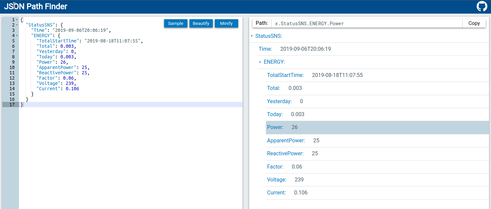

# Wert-Extraktion 
Bei Abfragen erhält der *Smart Appliance Enabler* oft eine umfangreiche Antwort (XML, JSON, ...), aus welcher der eigentliche Zahlenwert erst extrahiert werden muss.

Dazu kann an diversen Stellen im Smart Appliance Enabler entweder ein **JSON-Pfad** (Feldname: *Pfad für Extraktion*) und/oder ein regulärer Ausdruck (Feldname: *Regex für Extraktion*) konfiguriert werden.

Wird **beides angegeben** (also JSON-Pfad und regulärer Ausdruck), dann wird der reguläre Ausdruck auf das Ergebnis des JSON-Pfad angewendet.

## Mit JSON-Pfad
Diese Methode zur Wert-Extraktion funktioniert nur, wenn die Antwort im JSON-Format vorliegt!

Ob eine Antwort im JSON-Format vorliegt, lässt sich recht gut an den geschweiften Klammern erkennen, welche deren Struktur bestimmen. 

Der JSON-Pfad lässt sich relativ einfach mit dem [JSON Path Finder](https://jsonpathfinder.com/) betimmen: Einfach das JSON auf der _linken Seite_ einfügen (kann aus dem Log entnommen werden, wenn der *Smart Appliance Enabler* bereits mit diesem Gerät kommuniziert). Danach kann man auf der _rechten Seite_ die Datenstruktur aufklappen und den gewünschten Wert selektieren. Der jeweilige JSON-Pfad (englisch: path) wird dann oberhalb angezeigt, beginnend mit `x`. Bei der Übernahme des Pfades in den *Smart Appliance Enabler* muss dieses `x` durch ein `$` ersetzt werden.

Für obiges Beispiel muss im *Smart Appliance Enabler* konfiguriert werden:

`Pfad für Extraktion`: `$.StatusSNS.ENERGY.Power`

Damit der *Smart Appliance Enabler* weiss, dass die Antwort als JSON interpretiert werden soll, muss ausserdem als `Format` `JSON` angegeben werden!

## Mit regulärem Ausdruck

Die Wert-Extraktion mit einem [regulären Ausdruck](http://www.regexe.de/hilfe.jsp) muss den gewünschten Wert in der ersten Capture Group liefern. 

Zum Testen, ob der gewählte reguläre Ausdruck den gewünschten Wert aus der Antwort extrahiert, eignet sich die Webseite [RegEx101](https://regex101.com/). Der Vorteil dieses Testers ist, dass er direkt während der Eingabe evaluiert, es muss also nicht nach jeder Änderung auf einen Button geklickt und die Übertragung des Ergebnisses gewartet werden.

Ausser dem regulären Ausdruck benötigt man die Antwort, aus welcher der Wert extrahiert werden soll. Wenn der *Smart Appliance Enabler* bereits mit diesem Gerät kommuniziert, kann dessen Antwort dem Log entnommen werden.

Im folgenden Beispiel ist der Zählerstand der Wärmepumpe in einem Text (`waermepumpe=...`) enthalten:

Durch Eingabe der nachfolgenden Werte auf [RegEx101](https://regex101.com/) kann man prüfen, ob der reguläre Ausdruck den Zahlenwert korrekt extrahiert:

_Regular Expression_: `(\d+.?\d*)`

_Test String_: `waermepumpe=235.419998`

Der Wert `235.419998` wurde erfolgreich extrahiert und ist in der Capture Group 1 enthalten.

Im *Smart Appliance Enabler* muss also der folgende reguläre Ausdruck konfiguriert werden:

`Regex für Extraktion`: `(\d+.?\d*)`

`Format`: leer lassen
