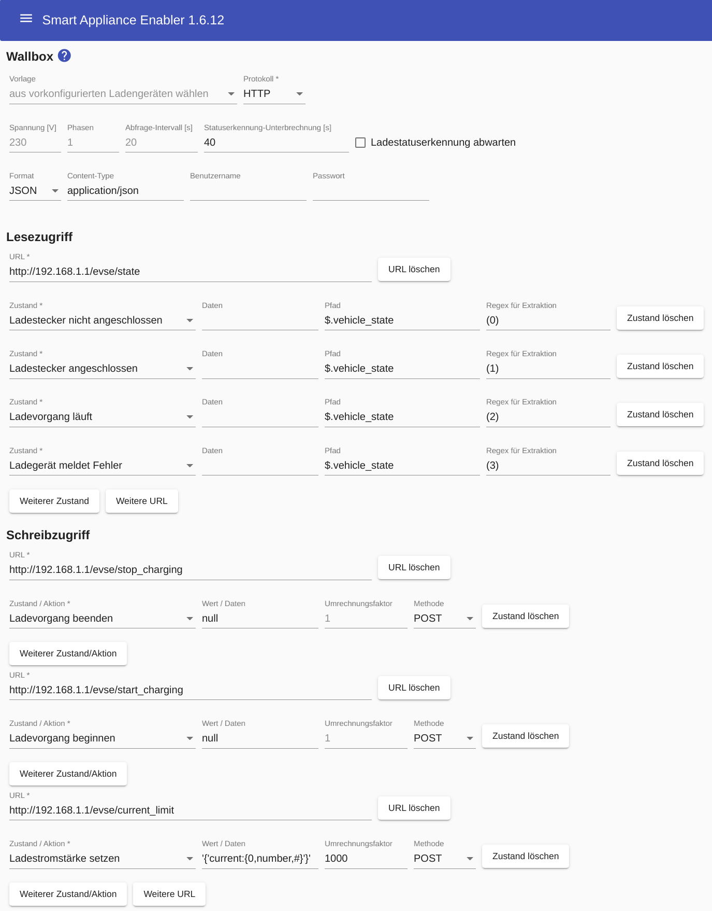

# WARP Charger

Die Modellreihen Smart und Pro des [WARP Charger](https://www.warp-charger.com/) können über HTTP vom *Smart Appliance Enabler* gesteuert werden.

Bei Verwendung dieser Wallbox ist kein separater Stromzähler erforderlich, weil der Zählerwert von der Wallbox selbst mit hoher Genauigkeit bereitgestellt wird und der *Smart Appliance Enabler* daraus die aktuelle Leistungsaufnahme berechnet.

## Konfiguration im Smart Appliance Enabler

### Wallbox

Für die Konfiguration sollte die Vorlage `WARP Charger` verwendet werden - dadurch werden alle Felder korrekt ausgefüllt. Lediglich die IP-Adresse bzw. der Hostname in den URL-Feldern muss auf die des WARP-Chargers angepasst werden.

### Zähler

Wie oben geschrieben muss der WARP Charger selbst als Zähler angegeben werden, d.h. die IP-Adresse bzw. der Hostname in den URL-Feldern muss auf die des WARP-Chargers angepasst werden.

Als `Format` muss `JSON` ausgewählt werden, damit die Antworten des WARP Charger korrekt interpretiert werden können.

Das Feld `Pfad` muss den Wert `$.energy_abs` enthalten, damit der *Smart Appliance Enabler* weiss, an welcher Stelle in der Antwort des WARP-Chargers der Wert für die Energiemenge enthalten ist.

Als Zustand ist `Zählerwert` zu wählen.

