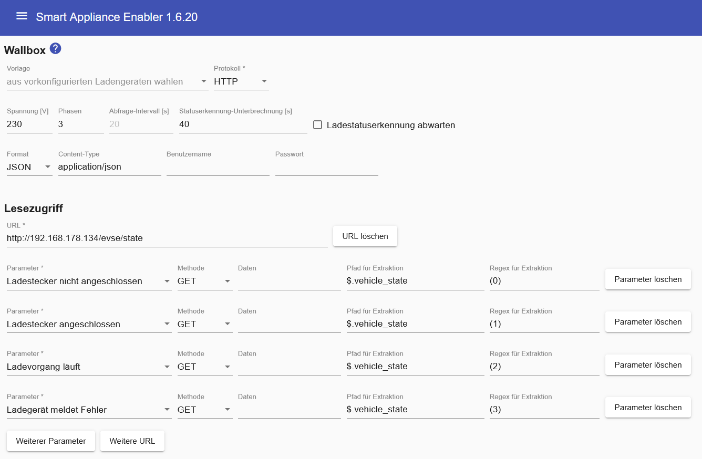
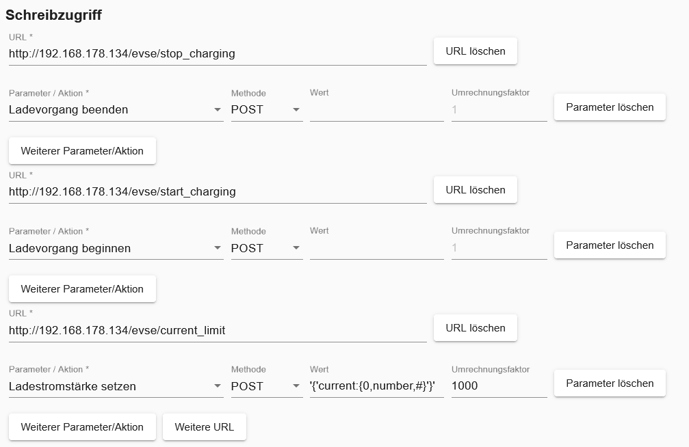
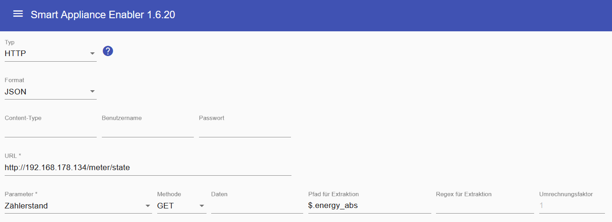

# WARP1 und WARP2 Charger
The Smart and Pro series of the [WARP Charger](https://www.warp-charger.com/) can be controlled by the *Smart Appliance Enabler* via HTTP.

When using the Wallbox WARP (2) Pro, no separate electricity meter is required because the meter value is provided by the Wallbox itself with high accuracy and the *Smart Appliance Enabler* calculates the current power consumption from it.

## Configuration in Smart Appliance Enabler
### Wallbox
The template `WARP Charger` should be used for the configuration - this will fill out all fields correctly. Only the IP address or the host name in the URL fields has to be adjusted to that of the WARP charger.

### Meter
As written above, the WARP Charger itself must be specified as a counter, i.e. the IP address or host name in the URL fields must be adjusted to that of the WARP Charger.

`JSON` must be selected as `Format` so that the responses of the WARP Charger can be interpreted correctly.

The `Extraction path` field must contain the value `$.energy_abs` so that the *Smart Appliance Enabler* knows where the WARP Charger response contains the energy value.

`Meter reading` is to be selected as the state.

