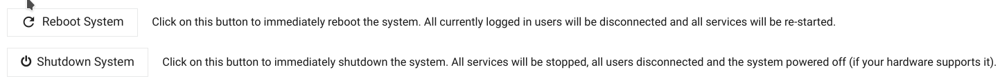

# Administration von Raspberry Pi und Smart Appliance Enabler mit `webmin`

Standardmässig wird [webmin](https://www.webmin.com) installiert, wodurch der Raspberry Pi mittels Web-Browser administriert werden kann. Das ist sehr hilfreich, wenn man sich nicht mit Linux auskennt.

`webmin` ist erreichbar unter der URL: `https://raspi:10000`, wobei "raspi" durch Hostname oder IP-Adresse des Raspberry PI zu ersetzen ist. Aktuell scheint das Zertifikat nicht gültig zu sein, weshalb man im Web-Browser bestätigen muss, dass man trotzdem *webmin* aufrufen möchte.

Danach erscheint die Anmeldeseite von *webmin*, wo man sich mit dem Benutzer `sae` und dem während der Installation vergebenen Passwort anmelden kann.

## Dashboard
Nach der erfolgreichen Anmeldung gelangt man zum **Dashboard**, das einen guten Überblick über den aktuellen Systemzustand bietet:

## Dateiverwaltung
Der File Manager ermöglicht das Verwalten der Dateien, wobei hier insbesondere das Verzeichnis `/opt/sae` interessant ist. Nachdem man dieses Verzeichnis links in der Baumansicht angeklickt hat, werden rechts die in dem Verzeichnis befindlichen Dateien angezeigt. 

Durch Klick auf eine Datei mit der rechten Maustaste werden die möglichen Datei-Operationen angezeigt:

Durch Klick auf das File-Menü oben werden auch Verzeichnis-Operationen angezeigt, wie beispielsweise "Upload to current directory":

## Dienstverwaltung
Der *Smart Appliance Enabler* ist ein Dienst, der durch die Dienstverwaltung des Raspberry Pi (systemd) gestartet oder gestoppt wird

In die Dienstverwaltung gelangt man im Seitenmenü über den Punkt `System` und den Unterpunkt `Bootup and Shutdown`.

Um den *Smart Appliance Enabler* zu starten/stoppen/restarten muss in der Listen mit den Diensten die Checkbox vor `smartapplianceenabler.service` aktiviert werden und dann die entsprechende Schaltfläche unterhalb der Listen mit den Diensten angeklickt werden.

## Ausschalten (Shutdown) / Neustart (Reboot)
Um das Risiko einer beschädigten SD-Karte zu minimieren, sollte der Raspberry Pi zum Ausschalten/Neustart nicht einfach vom Strom getrennt werden. Stattdessen sollte im im Seitenmenü über den Punkt `System` und den Unterpunkt `Bootup and Shutdown` auf eine Seite navigiert werden, auf der sich ganz unten die Schaltflächen `Reboot System` und `Shutdown System` befinden. Durch Klick auf einer dieser beiden Schaltfläche wird die entsprechende Aktion so ausgeführt, dass das Dateisystem auf der SD-Karte geschont wird.

