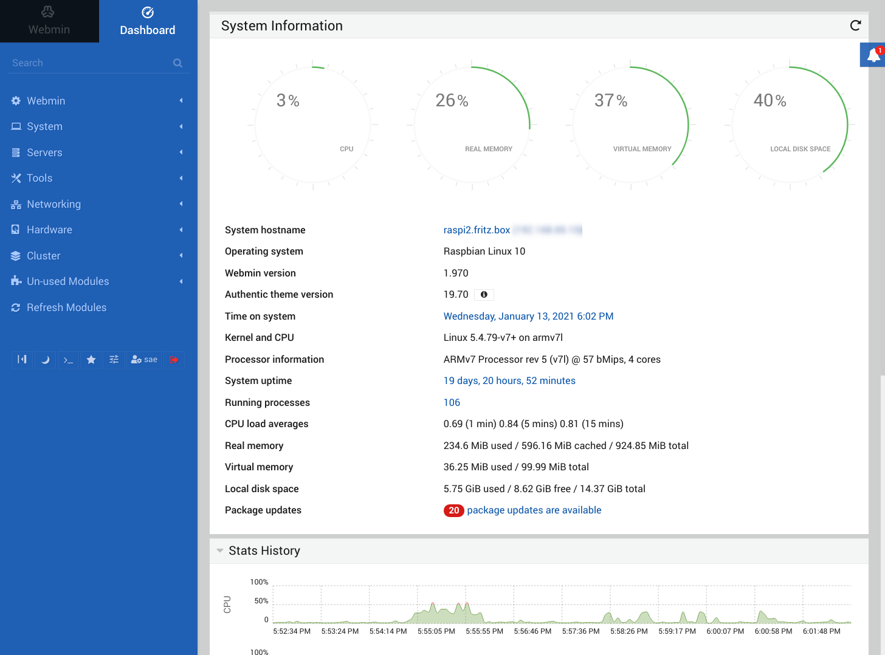
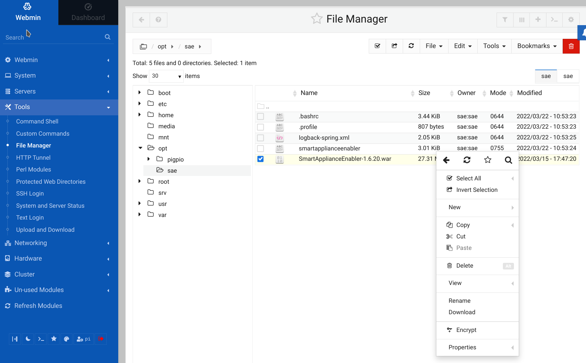
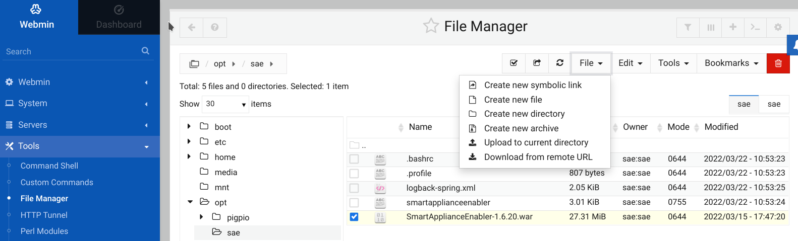
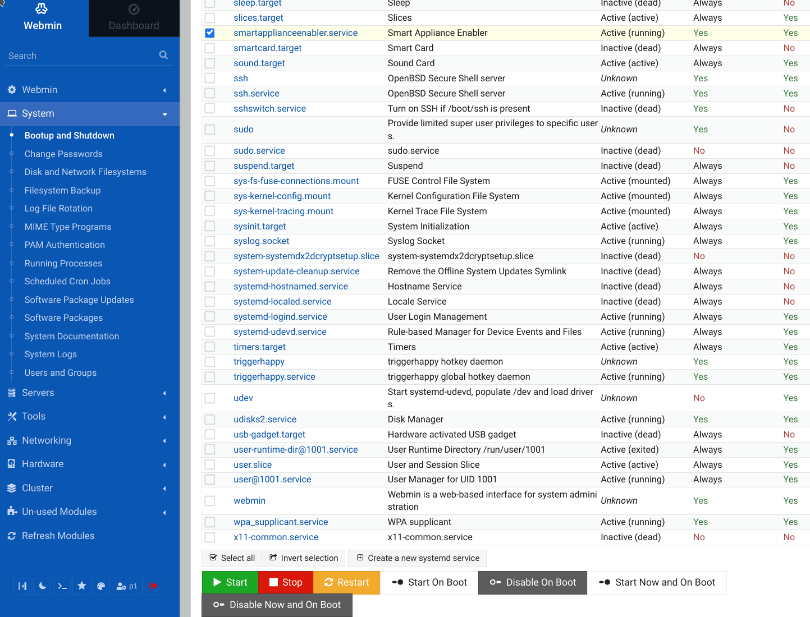
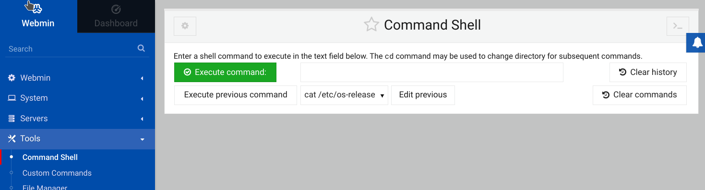
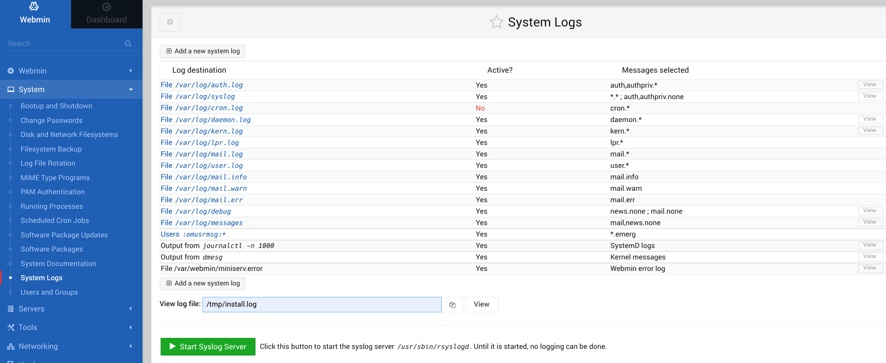
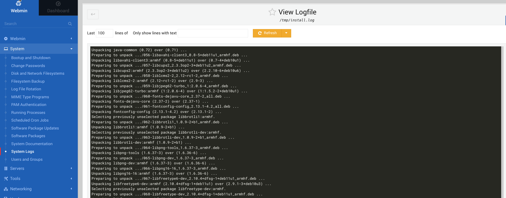
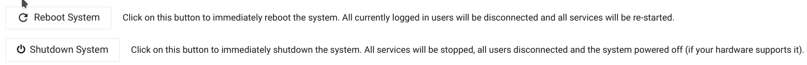

# Administration of Raspberry Pi and Smart Appliance Enabler with `webmin`
[webmin](https://www.webmin.com) is installed by default, which allows the Raspberry Pi to be administered using a web browser. This is very helpful if you are not familiar with Linux.

`webmin` can be reached at the URL: `https://raspi:10000`, where "raspi" is to be replaced by the host name or IP address of the Raspberry PI. The certificate does not seem to be valid at the moment, which is why you have to confirm in the web browser that you still want to call up *webmin*.

The *webmin* login page then appears, where you can log in with the user `sae` and the password assigned during installation.

## Dashboard
After successfully logging in, you get to the **Dashboard**, which offers a good overview of the current system status:

## File management
The file manager enables the management of the files, whereby the directory `/opt/sae` is of particular interest. After clicking on this directory in the tree view on the left, the files in the directory are displayed on the right.

By clicking on a file with the right mouse button, the possible file operations are displayed:

Clicking on the File menu at the top also shows directory operations, such as `Upload to current directory`:

## Service management
The *Smart Appliance Enabler* is a service that is started or stopped by the Raspberry Pi (systemd) service manager

You can access the service management in the side menu via the item `System` and the sub-item `Bootup and Shutdown`.

In order to start/stop/restart the *Smart Appliance Enabler* in the service list, the checkbox in front of `smartapplianceenabler.service` must be activated and then the corresponding button below the service list must be clicked.

## Command Shell
Commands can be executed by clicking on the `Tools` item and the `Command Shell` sub-item in the side menu.

## Display log files
The log file can be displayed by clicking on the item `System` and the sub-item `System Logs` in the side menu.
The path to any log file can also be displayed behind `View log file`, after which you have to click on `View`.

The 'Refresh' button is very helpful. It offers the option of specifying how many seconds the display should be refreshed via a drop-down menu. Before doing this, you should reduce the value for `Last ... lines of` (e.g. to 50), otherwise the last lines may not be visible.

## Shutdown / Reboot
In order to minimize the risk of a damaged SD card, the Raspberry Pi should not be simply unplugged from the power supply to switch it off/reboot. Instead, you should navigate in the side menu via the item `System` and the sub-item `Bootup and Shutdown` to a page on which the buttons `Reboot System` and `Shutdown System` are located at the bottom. By clicking on one of these two buttons, the corresponding action is carried out in such a way that the file system on the SD card is protected.

