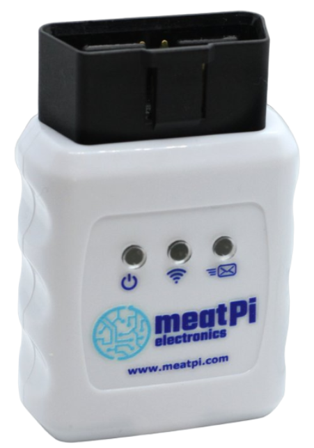

# WiCAN ODB2 Adapter



The [WiCAN ODB2 adapter from MeatPi](https://www.meatpi.com/products/wican) **connects the vehicle's CAN bus with the WLAN and enables communication via MQTT**.

## Functionality
The adapter remains **permanently plugged into the vehicle**.

When the vehicle approaches the house, the **WiCAN connects to the WiFi** and sends an MQTT message that it is **online**. The [wican-status.sh](https://github.com/camueller/SmartApplianceEnabler/raw/master/run/soc/wican/wican-status.sh) script waits for this and **requests the SOC** using an MQTT message. The [wican-soc.sh](https://github.com/camueller/SmartApplianceEnabler/raw/master/run/soc/wican/wican-soc.sh) script, which extracts the **SOC, is waiting for the answer and published together with a timestamp as an MQTT message (with retained flag)**.

As soon as the **vehicle is connected to the wallbox**, the *Smart Appliance Enabler* will run the [SOC script for WiCAN ODB2 adapter](https://github.com/camueller/SmartApplianceEnabler/raw/master/run/soc/wican/soc.sh), which receives the MQTT message with SOC and timestamp from the MQTT server.

Approximately 3 minutes after switching off the vehicle **the WiCAN ODB2 adapter also switches off** in order not to put a strain on the vehicle battery.

## Configuration of WiCAN ODB2 adapter

Important settings for configuring the WiCAN ODB2 adapter are:

### AP Config
- Mode: AP+Station

### Station Config
- SSID: SSID of the WiFi from the house
- Password: Password for the WiFi in the house

### CAN
- Protocol: elm327
- MQTT: Enable

### BLE
- BLE Status: Disabled

### Sleep mode
- Sleep: Enable

### MQTT
- MQTT URL: IP address of the MQTT server
- MQTT Port: Port of the MQTT server

## Installation for Smart Appliance Enabler

First, the MQTT clients must be installed so that the shell scripts can interact with the MQTT server:

```bash
sudo apt install mosquitto clients
```
The installation

- the script for monitoring the WiCAN status
- the script for retrieving the SOC
- SOC script for WiCAN ODB2 adapter

is done with the following commands:

```bash
$ mkdir /opt/sae/soc
$ sudo wget https://github.com/camueller/SmartApplianceEnabler/raw/master/run/soc/wican/wican-status.sh -P /opt/sae/soc
$ sudo wget https://github.com/camueller/SmartApplianceEnabler/raw/master/run/soc/wican/wican-soc.sh -P /opt/sae/soc
$ sudo wget https://github.com/camueller/SmartApplianceEnabler/raw/master/run/soc/wican/soc.sh -P /opt/sae/soc
$ chmod +x /opt/sae/soc/*.sh
```

**The scripts `wican-status.sh` and `wican-soc.sh` must be adapted for the respective vehicle**: The CAN message to request the SOC must be entered in `wican-status.sh`. In `wican-soc.sh` the SOC needs to be extracted from the response. Both scripts currently work for the Nissan Leaf ZE1 without any adjustments. The CAN messages for a specific vehicle can usually be found in relevant Internet forums or using **apps such as "Car Scanner"**, which is supported by the WiCAN-OBD2 adapter.

Systemd services are used to start the first two scripts:
```bash
$ sudo wget https://github.com/camueller/SmartApplianceEnabler/raw/master/run/lib/systemd/system/wican-status.service -P /lib/systemd/system
$ sudo wget https://github.com/camueller/SmartApplianceEnabler/raw/master/run/lib/systemd/system/wican-soc.service -P /lib/systemd/system
$ sudo systemctl daemon reload
```

The following commands are only described for `wican-status`. They apply analogously to `wican-soc`.

To start, all you need is:

```bash
$ sudo service wican status start
```

The status can be displayed as follows:

```bash
$ sudo service wican-status status
● wican-status.service - WiCan status monitor
      Loaded: loaded (/etc/systemd/system/wican-status.service; enabled; vendor preset: enabled)
      Active: active (running) since Sun 2024-02-25 14:36:10 CET; 1h 40min ago
    Main PID: 27260 (wican-status.sh)
       Tasks: 2 (limit: 4915)
         CPU: 431ms
      CGroup: /system.slice/wican-status.service
              ├─27260 /bin/bash /opt/sae/soc/wican-status.sh
              └─27261 mosquitto_sub -h 192.168.1.1 -t wican/5432048f421d/status -C 1

Feb 25 14:36:10 raspi2 systemd[1]: Started WiCan status monitor.
Feb 25 14:36:10 raspi2 wican-status.sh[27260]: Waiting for message ...
```

Stop it with:

```bash
$ sudo service wican-status stop
```

In order for the services to be started even after a reboot, they must be activated accordingly:
```bash
$ sudo systemctl enable wican-soc
Created symlink /etc/systemd/system/multi-user.target.wants/wican-soc.service → /etc/systemd/system/wican-soc.service.
$ sudo systemctl enable wican status
Created symlink /etc/systemd/system/multi-user.target.wants/wican-status.service → /etc/systemd/system/wican-status.service.
```

## Smart Appliance Enabler configuration
The configuration must be configured under “Wallbox”:

- Script to read the SOC: `/opt/sae/soc/soc.sh`
- Retry: [] Enabled (not selected)

This ensures that the script is only executed once after connecting to the wallbox, because the SOC script can only provide the correct value at this point in time.