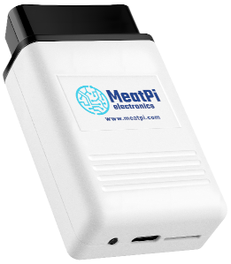

# WiCAN PRO OBD2 Adapter



The [WiCAN PRO OBD2 adapter from MeatPi](https://www.meatpi.com/products/wican-pro) **connects the vehicle's CAN bus to Wi-Fi and enables communication via MQTT**. This eliminates the need to use a vehicle manufacturer's API or a paid service to determine the state of charge (SOC). Additionally, the adapter can be used to make the SOC available via Bluetooth while driving to apps like "A Better Route Planner" for charging planning.

I have created a [YouTube video](https://www.youtube.com/watch?v=VgXChG5o-E8) on using the WiCAN PRO with the *Smart Appliance Enabler*.

## Functionality
The adapter remains **permanently plugged into** the vehicle. To prevent a constant drain on the vehicle battery, **Sleep Mode** shuts down the WiCAN PRO a few minutes after the vehicle is turned off. The WiCAN PRO wakes up again when the vehicle is turned on. Shutting down the WiCAN PRO makes sense primarily because the CAN bus also powers down shortly after the vehicle is turned off, meaning it can no longer provide data to the WiCAN PRO.

When the vehicle approaches the house, the WiCAN PRO connects to the home Wi-Fi network. **Automate Mode** ensures that the values ​​configured in the vehicle profile are periodically queried from the CAN bus and transmitted to the configured destinations—in my case, an MQTT topic. After the vehicle is turned off and locked, the CAN bus remains active for some time. The duration depends on the vehicle and even the software version; following a software update on my vehicle, this period increased from approximately 5 minutes to 15 minutes. When the CAN bus becomes inactive, the vehicle's electrical system voltage drops below the threshold for the WiCAN PRO's sleep mode. In my vehicle, it drops from about 15V to around 12V. If the voltage remains below the threshold for the configured duration, the WiCAN PRO shuts down.

As soon as the vehicle is turned on again, the WiCAN PRO wakes up from sleep mode, and Automate Mode resumes the periodic transmission of configured values ​​to the configured destinations. Naturally, once the vehicle leaves the range of the home Wi-Fi network, values ​​are no longer transmitted to the configured destinations. As soon as the vehicle approaches the house again, the process described here begins anew.

## Configuration of WiCAN OBD2 adapter

Important settings for configuring the WiCAN PRO OBD2 adapter are:

### Tab: Settings
#### AP Config
- Mode: AP+Station or BLE+Station
- AP Password: Password for accessing the WiCAN PRO's Wi-Fi network when it is not connected to the home Wi-Fi network.

#### Network Configuration
- SSID: SSID of the house's Wi-Fi network
- Password: Passwort of the house's Wi-Fi network
- Security: Security of the house's Wi-Fi network

#### CAN
- Protocol: AutoPID
- MQTT: Enable

#### MQTT
- MQTT URL: Hostname or IP address of the MQTT server
- MQTT Port: Port of the MQTT server
- TX-Topic: is automatically specified
- RX-Topic: is automatically specified
- Status-Topic:e.g., like TX-Topic, but replace "tx" with "status"

### Tab:Automate
#### User Destinations:
MQTT-Topic: e.g., like TX-Topic, but replace "tx" with "automate"

#### Automate Parameters
Vehicle Specific

#### Vehicle Specific PIDs
Vehicle Specific PIDs: Enable
Vehicle Model: Select profile for the vehicle

### Tab:Power Saving
#### Sleep Mode
- Sleep: Enable
- Sleep Voltage: This value depends on the vehicle and the condition of the 12V battery and may need to be adjusted if the WiCAN PRO does not enter sleep mode.
- Sleep After: z.B. 5 min
- Perdiodic wake up: Disable


## Installation for Smart Appliance Enabler

First, the MQTT clients must be installed to enable the shell scripts to interact with the MQTT server:

```bash
sudo apt install mosquitto-clients
```

The script for retrieving the SOC is installed using the following commands:

```bash
$ mkdir /opt/sae/soc
$ sudo wget https://github.com/camueller/SmartApplianceEnabler/raw/master/run/soc/wican/soc.sh -P /opt/sae/soc
$ chmod +x /opt/sae/soc/*.sh
```

## Configuring the Smart Appliance Enabler
In the configuration, the following settings must be made under "Wallbox":

- Script for reading the SOC: `/opt/sae/soc/soc.sh`
- Execution repetition: [] Enabled (not selected)

This ensures that the script runs only once after connecting to the wallbox, as the SOC script can only provide the correct value at that specific time.